In Chapter {{chapter_inference}}, we started to formalize the mathematics behind statistical analysis in order to make claims about populations based on  samples. In this chapter, we are going to explore a family of techniques for predictive modeling, which makes claims about new data based on relationships found in previous data, called regression analysis.

## Modeling a Linear Relationship

Predictive modeling generally means coming up with an equation that relates the value of one random variable to the value of one or more other random variables. Generally, we write these equations in terms of parameters, then estimate those parameters using estimation techniques based on a sample.

The simplest kind of relationship we can model using an equation is a linear one: where one variable consistently goes up or down when the other goes up. This model looks like a familiar linear equation:
$$
\hat y = mx + b
$$
Here, the hat indicates that y is a prediction of the true y. X is a random variable while m and b are parameters that we have to estimate based on a dataset consisting of n x-y pairs. Estimating these parameters based on data means asking: what is the line of best fit?

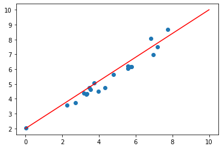  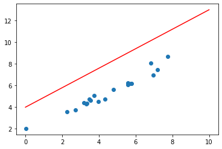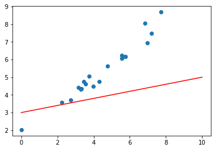    

Which of these do you think is the best fit for the data shown? If you said the first one, statisticians would agree with you.

We can formalize the idea of "goodness of fit" using a quantitative measure called a loss function. In this case, the measure statisticians use as their loss function is the sum of squared error between the prediction (the line) and the true values (the dots). We can draw those differences, called "residuals," as lines on the plot:

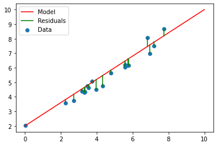  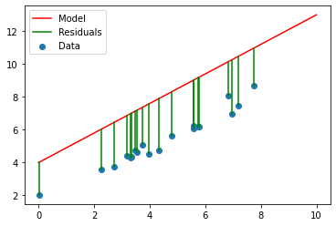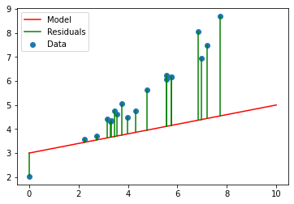    

Now it is clearest that the best line is the one that has the smallest length residuals. This problem formulation is called "Ordinary Least Squares" linear regression. The term regression is often a little intimidating for students, but it just means "going back" since regression explains variance in an effect variable (y) by tracing that variance back to a cause variable (x).

Generally, if we want to get the smallest lengths, we have two options: we can take the absolute value of the difference, or we can square the difference. Statisticians and data scientists generally prefer to square the difference, for reasons related to calculus. We can translate this idea into mathematics:
$$
\mathcal{L}(y, \hat y) = \sum\limits_{i=1}^n (y_i - \hat y_i)^2
$$
The first symbol there is a script L, which we use for "loss." You can see it is a function of y (the true y values) and y-hat (the estimates, the height of the line under each data point), and it goes point by point and measures the distance between the two, squared.

Now, we need to find the best possible values of the parameters to minimize the loss. We can do that using the concept of optimization from calculus. If you have studied calculus, the idea is to take the derivative of the loss with respect to b, set it equal to zero and solve. Then take the derivative of the loss with respect to m, set it equal to zero and solve. Ultimately, the solution ends up being:
$$
b = \bar y - m \bar x \\
m = \frac{\sum\limits_{i=1}^n (x_i - \bar x) (y_i - \bar y)}{\sum\limits_{i=1}^n (x_i - \bar x)^2}
$$
For practical purposes, this solution is implemented in a library called scipy.

```python
from scipy.stats import linregress
m,b,r,p,stderr = linregress(x,y)
```

This function takes a 1D array of X values and a 1D array of Y values and returns five things:

* m is the slope of the line
* b is the y-intercept of the line
* r is the correlation between x and y
* p is the probability that m = 0, based on a hypothesis test
* stderr is the standard error of m

The p value is a often-challenging topic for students of statistics. 

Crucially, these values are only valid if we make a certain set of assumptions about the data:

* We assume that the data actually has a **linear relationship**
  * If it doesn't (the values seem to lie near a curve, not a line), we may want to use a polynomial or other kind of regression instead.
* We assume that each data point's deviation from the line is due to **normally distributed** random error.
  * If it's not (the values aren't mostly near the line) you probably shouldn't trust the standard error.
* We assume that the random error has **variance that does not depend on the value of X**. This has a fancy statistical name: *homoscedasticity*. When the variance does depend on the value of X, we say that the data is *heteroscedastic*.
  * If it's not (the values spread more towards one end of the line than the other), you probably can't use the standard error or p value. This is a common problem when working with financial data. Often, taking the log of the y values can make the data more homoscedastic.

### Explanation of Variance

A popular summary statistic for evaluating the quality of a linear regression is the "coefficient of determination" R-squared:
$$
R^2=1 - \frac{\sum\limits_{i=1}^n (y_i - \hat y_i)^2}{\sum\limits_{i=1}^n (y_i - \bar y)^2}
$$
In the context of one dimensional linear regression, this statistic also turns out to be exactly equal to the correlation between X and Y, squared (hence the symbol R-squared).

Another way to interpret this statistic is to look at the top of the fraction, which is our loss, the sum of squared residuals vs. the bottom, which is the variance of y. From this perspective, R-squared measures the fraction of the variance in the data which is accounted for by our prediction, y-hat. This statistic can never be larger than 1, since the top and bottom of the fraction are sums of squares which can never be negative, however it can be less than zero if the m value from the regression model is seriously wrong and introduces more variance than it accounts for.

Importantly, this statistic only involves the true and predicted y values, so it is a very general evaluation metric for predictive models.

## Including Multiple X Values

Often, the variance in data is not fully explained by a single X value. For example, let's say we are trying to predict the price of houses. House price is based on many characteristics, including the size of the house, number of bedrooms, number of bathrooms and size of lot. We can apply linear regression to these sorts of problems by adding additional X values to our equation:
$$
\hat y = m_0 + m_1x_1 + m_2x_2 + ... + m_kx_k
$$
Instead of using separate symbols like b, we are now using subscripts for all of our parameters (commonly called "coefficients") to keep them consistent. This model is called *multiple regression*, as it includes multiple variables. There is a similarly elegant solution to this problem using multivariable calculus which is beyond the scope of this class which finds the optimal values for the coefficients to minimize the loss.

To actually use a multiple regression model, we will use a library called Scikit-learn:

```python
from sklearn.linear_model import LinearRegression

model = LinearRegression()
model.fit(X, y)
print('Score:', np.score(X,y))
y_pred = model.predict(new_x_values)
print('Coefficients:', model.coef_)
print('Intercept:', model.intercept_)
```

This library contains many different kinds of models for machine learning, which is a field of computer science closely related to predictive modeling in statistics. They all work roughly the same way on the surface:

* We create a model object using the syntax `model = LinearRegression()`
* We call the model's `fit` function on a 2D array of X values and a 1D array of Y values. Importantly, the X values must have shape `(n,m)` and the Y values must have shape `(n,)`
* Then we can do other things like score the quality of fit (which returns the R-squared value), make predictions for new y values or look at the coefficients and intercept of the model.

The values of the coefficients are often very interesting, as they indicate the strength of the linear relationship between each X variable and the Y variable *with all linear effects from other X variables taken into account*. A common statistical technique involves performing T tests on these parameters to determine if the association between a single X variable of interest is greater than zero after taking several confounding X variables into account.

### Polynomial Regression

Something else that we can do with multiple linear regression is fit polynomials to data. For example, let's say we have the following messy data about the relationship between the diameter and area of a circle:

```python
df = pd.read_csv('circle_data.csv')
x = df['Diameter']
y = df['Area']
plt.scatter(x,y)
plt.show()
```


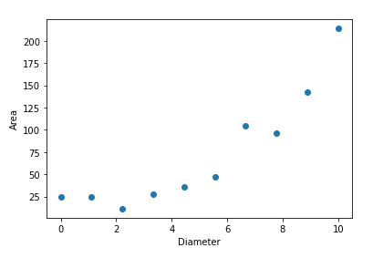

We could try applying linear regression to this dataset, but we immediately see a problem: the line becomes less accurate towards the start and end of the range of X values, indicating that the dataset is *nonlinear*, breaking our assumption of linearity.

```
m,b,r,p,stderr = linregress(x,y)
x_values = np.linspace(x.min(), x.max(), 100)
y_values = m * x_values + b
plt.scatter(x,y)
plt.plot(x_values, y_values, color='red')
plt.show()
```


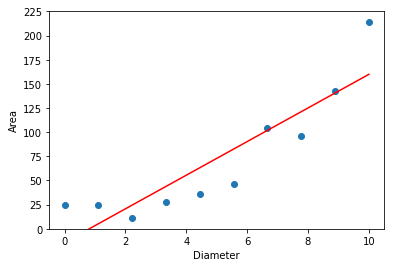

So something that we can do is add another column to the dataset derived from the x value.

```python
from sklearn.linear_model import LinearRegression

x2 = x ** 2
X = np.stack([x,x2], axis=-1)

model = LinearRegression()
model.fit(X, y)
print('Score:', np.score(X,y))
x_values2 = np.stack([x_values, x_values ** 2], axis=-1)
y_values2 = model.predict(x_values)

plt.scatter(x,y)
plt.plot(x_values2, y_values2)
plt.show()
```

In this code, we use `np.stack` which "stacks" two one dimensional arrays on top of each other in a new dimension. By specifying the axis as -1, we make sure the two arrays are stacked side by side as columns, rather than one above the other as rows.

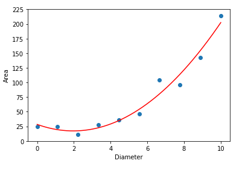

Notice that by adding x squared as a second x variable, we have effectively used multiple regression to fit the polynomial
$$
\hat y = m_2x^2 + m_1x+m_0
$$
to our data.

But why stop there? We could add an x cubed term and fit a degree 3 polynomial:

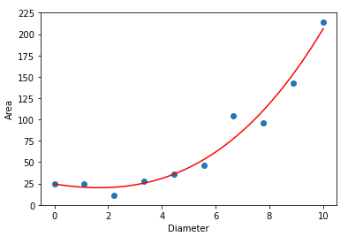

Or even fit a degree 10 polynomial!

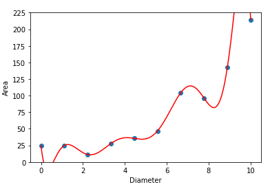

Which of these models is best?

If our only goal is minimizing the error, the model with as many terms as possible is best. But in data science, our goal is usually not minimizing the error, but modeling a real relationship in the world. As a result, we need some way to test whether our model actually generalizes or not. Data scientists typically test generalization by splitting the data into two groups: a training set and a testing set. The training set is used to fit the model, while the testing set is used to evaluate whether or not the model is *overfit* to the training data, meaning that it is too close to the training data and 

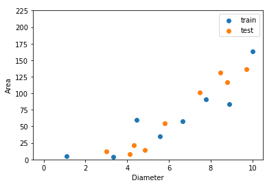

As you can see, the test set is another dataset taken from the same distribution as the training set. When we evaluate a good model, performance will be similar on the two:

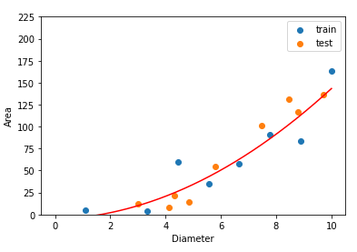

But when we evaluate an overfit model, performance will be much better on the training set than the test set:

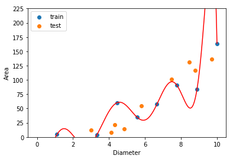

We can quantify this principle by plotting the training set and test set error vs. the degree of the model:

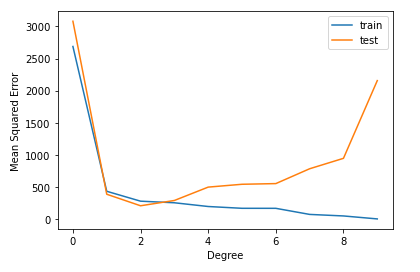

From this plot, we see that the test error is lowest when the model has degree 2, which makes sense because the data represents the diameter and area of a circle, which you probably know from geometry are connected by the equation:
$$
A=\pi (d/2)^2
$$