This page describes the Python library Matplotlib, short for "Matlab Plotting Library"and usually pronounced "mat plot lib." Matplotlib allows us to create data visualizations from our Python code.

## ICYMI: Importing Python Libraries

In case you missed it, we import python libraries using the `import` statement, followed by the name of the library. For example:

```python
import datetime
half_past_noon = datetime.time(12,30,0)
```

We can also optionally import libraries using a shorthand:

```python
import datetime as dt
half_past_noon = dt.time(12,30,0)
```

This allows us to save time when calling lots of functions from the same library.

For matplotlib, the only module from this library we will use at this level is `matplotlib.pyplot`, so we import matplotlib using this line of code:

```python
import matplotlib.pyplot as plt
```

The `plt` shorthand is an industry standard for matplotlib. For the remainder of this chapter, we will assume this line of code has been run already.

## ICYMI: Data types

When talking about data visualization, we consider two types of data: continuous and categorical.

* Continuous data is like numbers on a number line. There are an infinite (or seemingly-infinite) number of possible values  we can order them from smallest to largest.

## How to Plot

The simplest way to make a plot with matplotlib is the plot function:

```
data = [1,2,4,2,1]
plt.plot(data)
```

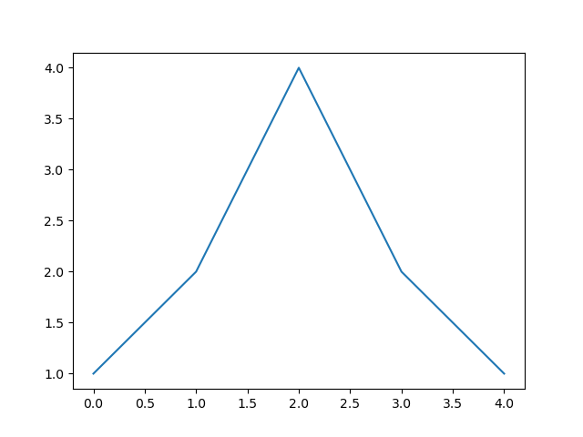

Matplotlib identified points on a 2D coordinate plane and connected them with straight blue lines. The X coordinates of those points were assumed to be integers 0 through 4 and the data was used for the Y coordinates.

If we want to specify the X coordinates, we can do that as well:

```python
x = [1,4,2,5,0]
y = [1,2,4,2,1]

plt.plot(x, y)
```

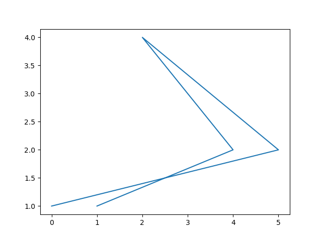

Now that we have specified both the X and Y coordinates, matplotlib simply connects the dots: from (1,1) to (4,2) to (2,4) to (5,2) to (0,1).

If we so choose, we can use numpy and matplotlib together to imitate a graphing calculator and plot a continuous function. Rather than plot an infinite number of values, we linearly interpolate along the domain of the function. For example, if we want to plot the parabola
$$
y = -x^2+3x+4
$$
We could do so with vectorized numpy operations on an array of points:

```python
import numpy as np
x = np.linspace(-10,10,1000)
y = -x**2 + 3 * x + 4
plt.plot(x,y)
```

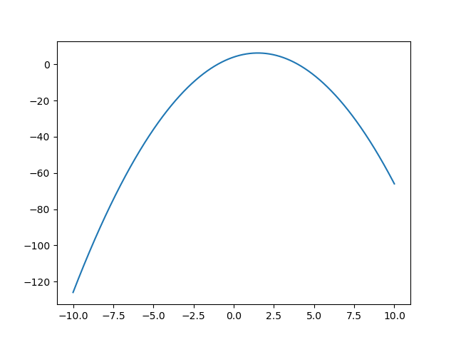

### Labeling the Axes

While seeing a line on a coordinate axis is fine, it doesn't tell the viewer much information about the data.

Let's say I've typed in the temperature every day for a week and want to plot it:

```python
temps = [66, 60, 55, 57, 40, 42, 38]
plt.plot(temps)
```

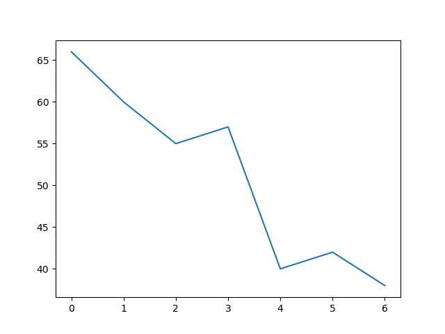

If we came back to this plot after a month, it would be hard to remember what it means. To avoid that problem, we label our axes:

```python
temps = [66, 60, 55, 57, 40, 42, 38]
plt.plot(temps)
plt.xlabel('Day of the Week')
plt.ylabel('Temperature (F)')
```

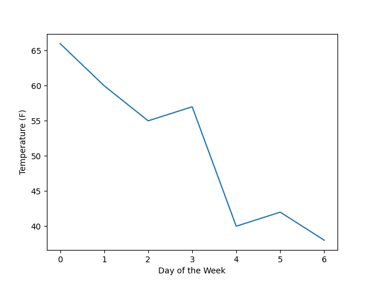

The xlabel function set the value of the x axis label while the ylabel function set the value of the y axis label. Now our plot is much easier to interpret.

We can also set the plot title with `plt.title`. For example:

```
temps = [66, 60, 55, 57, 40, 42, 38]
plt.plot(temps)
plt.xlabel('Day of the Week')
plt.ylabel('Temperature (F)')
plt.title('Daily Temperatures This Week')
```

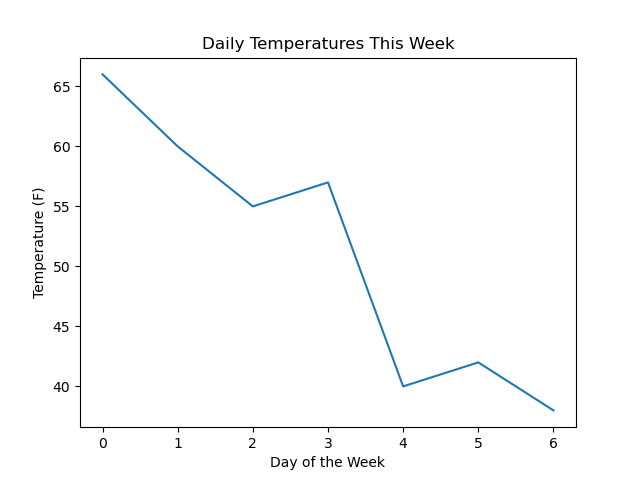

### Changing Axis Limits and Ticks

The range of each axis, by default, is set to the range of the data, plus a little bit on either end. If we want to expand that range we can set the limits with `plt.xlim(low, high)` and `plt.ylim(low, high)`. For example:

```
temps = [66, 60, 55, 57, 40, 42, 38]
plt.plot(temps)
plt.xlabel('Day of the Week')
plt.ylabel('Temperature (F)')
plt.title('Daily Temperatures This Week')
plt.ylim(30,90)
```

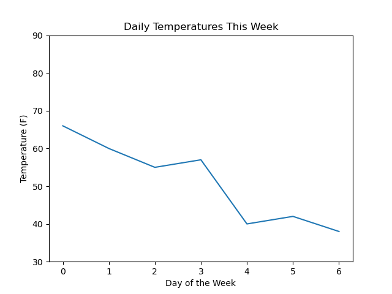

Sometimes, the numerical ticks are difficult to interpret. For example, in our temperature plot, is day 0 Monday or Sunday? Additionally, sometimes the automatic ticks are at confusing intervals. To remedy these problems, we can set the tick positions and tick labels using `plt.xticks(ticks, labels)` and `plt.yticks(ticks, labels)`. For example:

```
temps = [66, 60, 55, 57, 40, 42, 38]
days = ['Sunday', 'Monday', 'Tuesday', 'Wednesday', 'Thursday', 'Friday', 'Saturday']
plt.plot(temps)
plt.xlabel('Day of the Week')
plt.ylabel('Temperature (F)')
plt.title('Daily Temperatures This Week')
plt.xticks(range(7), days)
plt.yticks([40,50,60,70])
```

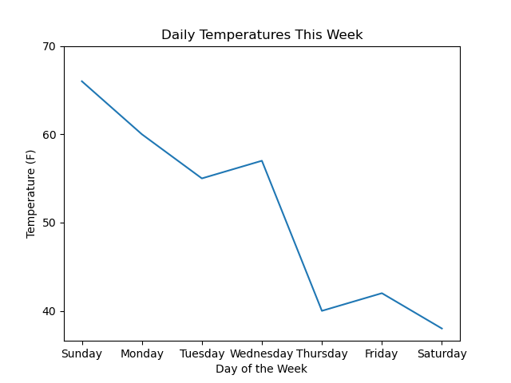

If we want to turn the axes off entirely, we can do so with `plt.axis('off')`. That removes the black box around the plot, the axis labels, the ticks and the tick labels.

### Changing Figure Size

Notice how the days are very close on the plot? It would be easier to read if the plot was slightly wider. We can change the size of the plot using `plt.subplots(figsize=(width_in_inches, height_in_inches))`. Note that this must be called *before* using any other matplotlib functions. The size is given in inches, rather than pixels, because the resolution can change, and the default value is (6.4, 4.8).

```
plt.subplots(figsize=(8,6))
temps = [66, 60, 55, 57, 40, 42, 38]
days = ['Sunday', 'Monday', 'Tuesday', 'Wednesday', 'Thursday', 'Friday', 'Saturday']
plt.plot(temps)
plt.xlabel('Day of the Week')
plt.ylabel('Temperature (F)')
plt.title('Daily Temperatures This Week')
plt.xticks(range(7), days)
plt.yticks([40,50,60,70])
```

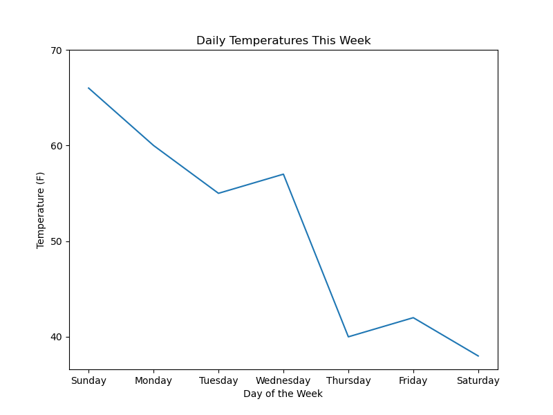

### Adding a Legend

If we have several plots on the same axes, it is difficult to tell which is which. The most common solution is to include a figure legend using `plt.legend()`. In order to make plots show up in the figure legend, however, we need to label them. For example, let's say we plot multiple weeks of temperature:

```
plt.subplots(figsize=(8,6))
temps_1 = [66, 60, 55, 57, 40, 42, 38]
temps_2 = [40, 42, 48, 50, 70, 52, 48]
days = ['Sunday', 'Monday', 'Tuesday', 'Wednesday', 'Thursday', 'Friday', 'Saturday']
plt.plot(temps_1, label='Week 1')
plt.plot(temps_2, label='Week 2')
plt.xlabel('Day of the Week')
plt.ylabel('Temperature (F)')
plt.title('Daily Temperatures This Week')
plt.xticks(range(7), days)
plt.yticks([40,50,60,70])
plt.legend()
```

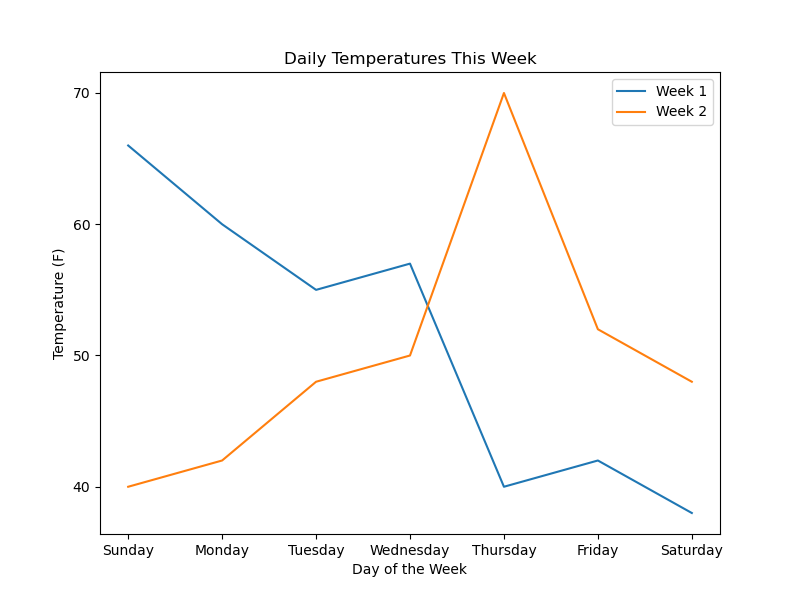

The two plots show up in different colors according to matplotlib's default color palette, and those colors are used in the legend to distinguish them. The labels come from each call to `plt.plot`. For more information on colors, see the section on colors below.

### Using Multiple Axes

The `plt.subplots` function allows us to set the figsize, but it's intended purpose is to create *subplots*: smaller plots with their own axes within the same image. We can create a grid of subplots using `plt.subplots(rows,columns)` with or without the optional figsize argument. For example:

```python
fig, ax = plt.subplots(2, 3)
```

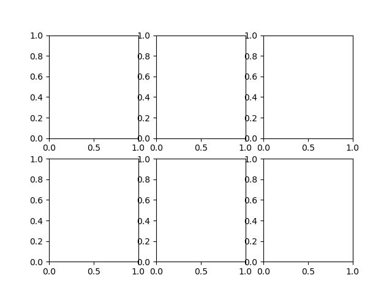

Notice how there are six subplots, two rows and three columns. Each subplot has its own axes. Also notice how the function has two return values, which are conventionally called `fig` and `ax`. `Fig` is the `Figure` object holding the entire plot. `ax` is a 2D numpy array of `Axes` objects, one for each axis, in this case a (2,3) array. We can access these separate axes by indexing ax and using it like plt. For example:

```
fig, ax = plt.subplots(2, 3)
ax[0,2].plot([2,3,5])
ax[0,1].axis('off')
```

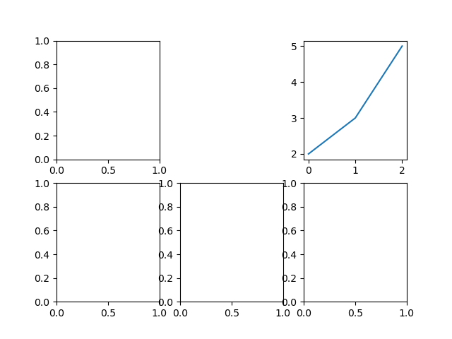

Notice how we disabled the axis for the axes at (0,1) and added a plot to the axes at (0,2) based on which elements of `ax` we used in place of `plt`.

### Saving Figures

If you are working in a Jupyter environment, just running the code that creates the plot is enough to see the plot. If you're writing a python script (e.g. a .py file) or working with ipython using the command line, you will have to tell matplotlib when to show the plot. We do this with `plt.show()`.

Before showing the plot, you can optionally save it to a file. To save to a file, use `plt.savefig(path)` where `path` is a valid image filename. There are several image file extensions that matplotlib can use, which you can see with the following code:

```python
fig = plt.figure()
fig.canvas.get_supported_filetypes()
```

On my computer, the output is:

```python
{'eps': 'Encapsulated Postscript',
 'jpg': 'Joint Photographic Experts Group',
 'jpeg': 'Joint Photographic Experts Group',
 'pdf': 'Portable Document Format',
 'pgf': 'PGF code for LaTeX',
 'png': 'Portable Network Graphics',
 'ps': 'Postscript',
 'raw': 'Raw RGBA bitmap',
 'rgba': 'Raw RGBA bitmap',
 'svg': 'Scalable Vector Graphics',
 'svgz': 'Scalable Vector Graphics',
 'tif': 'Tagged Image File Format',
 'tiff': 'Tagged Image File Format',
 'webp': 'WebP Image Format'}
```

What that means is that once I've create a plot, I can save as any of these types. For example, if I wanted to save the temperature example as a pdf:

```
temps = [66, 60, 55, 57, 40, 42, 38]
plt.plot(temps)
plt.xlabel('Day of the Week')
plt.ylabel('Temperature (F)')
plt.title('Daily Temperatures This Week')
plt.savefig('temperatures.pdf')
```

Now, the file `temperatures.pdf` is saved in the same directory as my notebook file.

## Plotting Functions

In addition to `plt.plot()` there are a variety of plotting functions for different common visualizations.

### Scatterplot

Usage: `plt.scatter(x,y,s=None, c=None, marker=None, cmap=None)`

Takes two arrays x and y and plots a point at each point (x[i], y[i]).

```
x = [1,2,3,5]
y = [2,2,3,1]
plt.scatter(x,y)
```

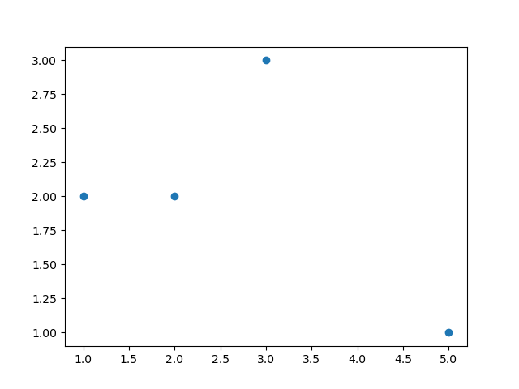

We can provide additional arguments which change the actual marks used to plot the points. s and c allow us to encode data into the size and color of the points, while marker allows us to set the marker symbol. By default, the marker symbol is a filled circle, but it can be set to other symbols as well. For example:

```
x = [1,2,3,5]
y = [2,2,3,1]
c = [0,1,2,3]
s = [8,16,32,64]
plt.scatter(x,y,s,c)
```

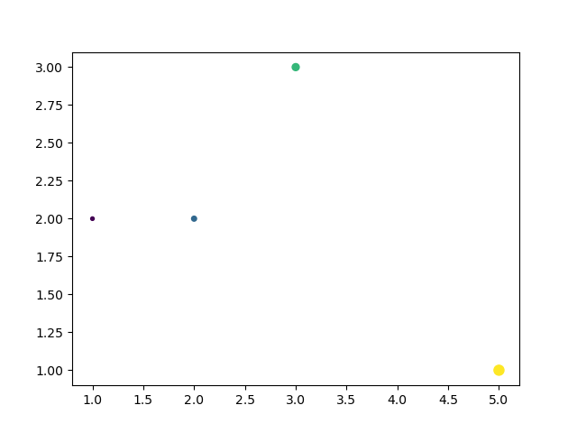

Notice how the size of the marker doubles each time, and the color changes from purple to yellow. Since the provided colors are scalars, they are mapped to colors using a *colormap*. See the section below on colormaps for more information.

### Barplot

Usage: `plt.bar(x, height, width=0.8, bottom=None)`

Takes two arrays: `x` and `height` and plots a bar at each `x[i]` with height `height[i]`. Usually, the X values are strings representing a categorical variable. For example, imagine we were doing a survey of favorite colors:

```
colors = ['red', 'orange', 'yellow', 'green', 'blue', 'indigo', 'violet']
votes = [25, 10, 12, 28, 35, 10, 20]
plt.bar(colors, votes)
plt.title('Favorite Colors')
plt.ylabel('People')
plt.xlabel('Colors')
```

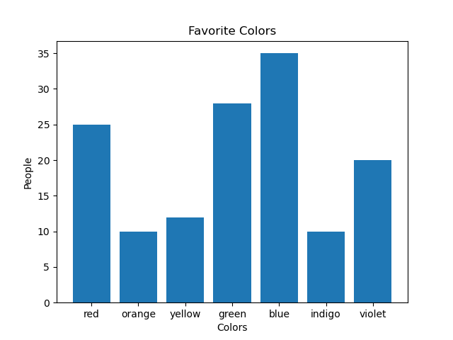

Sometimes you have many 

### Histogram

A histogram looks like a barplot, except it shows continuous data split into bins on the X axis and counts on the Y axis, showing the *distribution* of the data along the number line. We create a histogram from one-dimensional data using the `hist(data, bins=10)` function

```
data = [1,1,2,2,3,4,4,5,5,6,7,8,8,8,8,8,8,8,9,9,10,15,20]
plt.hist(data)
```

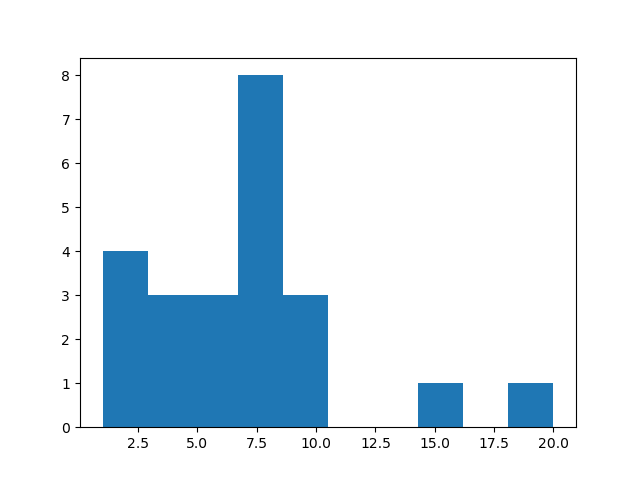

`plt.hist` chooses bins automatically by splitting the data range into tenths. If we look at the values of `bins` that it returns, we can see the bin boundaries:

```
counts, bins, plot = plt.hist(data)
bins
```

Out: `array([ 1. ,  2.9,  4.8,  6.7,  8.6, 10.5, 12.4, 14.3, 16.2, 18.1, 20. ]) `

These boundaries do not make much sense given the integer values of our data. If we want to specify a more appropriate bins, we have two options:

* We can specify the number of equal-sized bins
* We can specify the boundaries. For N bins, we have to specify N+1 boundaries.

For example, we could use 19 bins to align with the data range 1-20:

```
data = [1,1,2,2,3,4,4,5,5,6,7,8,8,8,8,8,8,8,9,9,10,15,20]
counts, bins, plot = plt.hist(data, bins=19)
plt.show()
```

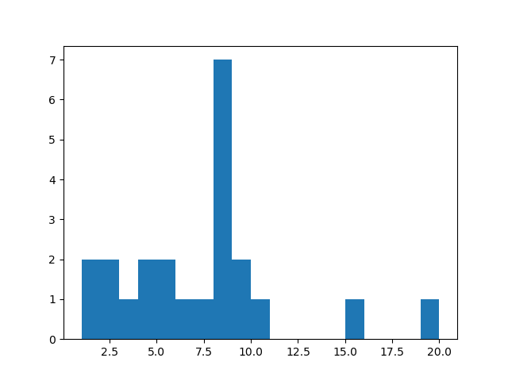

Or we could choose bins which are not all the same size:

```
data = [1,1,2,2,3,4,4,5,5,6,7,8,8,8,8,8,8,8,9,9,10,15,20]
counts, bins, plot = plt.hist(data, bins=[1,4,8,12,20])
plt.show()
```

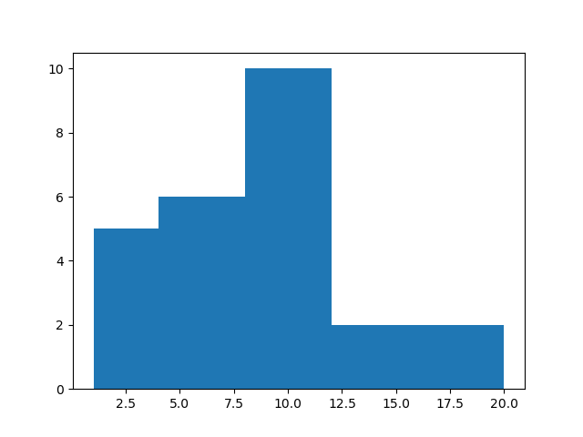

Now, there are four bins. (1,2,3) go in one bin, (4,5,6,7) go in another, (8,9,10,11) go in a third and (12,13,14,15,16,17,18,19,20) go in another.

### Box and Whisker Plot

Another option for displaying the distribution of one-dimensional data is the box and whisker plot, often called boxplots. In these plots, the different parts show the *quartiles* of the data: divisions of the number line which place 25% of the observations in each section. For example:

```
data = [1,2,3, 4,4,5, 6,7,9, 10,10,11]
plt.boxplot(data)
```

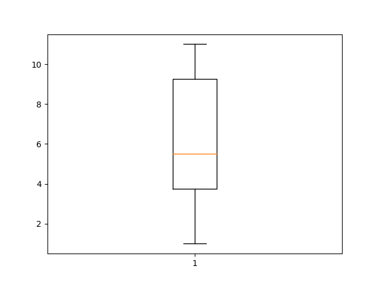

In the code above, I have separated the data list visually into quartiles. The orange line in the plot shows the *median* of the data, halfway between the two middle elements of 5 and 6. The box shows the first and third quartiles at just before 4 and just after 9, respectively. The whiskers, or vertical lines, show the range of the data, from 1 to 11. This plot shows us, at a glance, that half of the data occurs within the box and half occurs outside it.

The most common application of boxplots is comparing the distributions of two groups. We can show two boxplots on the same axes by passing a nested list into `plt.boxplot`. For example, if we had data from a two-group experiment:

```
data_a = [1,2,3, 4,4,5, 6,7,9, 10,10,11]
data_b = [1,3,5, 7,8,8, 9,10,10, 11,11]
plt.boxplot([data_a, data_b])
plt.xticks([1,2], ['Group A', 'Group B'])
```

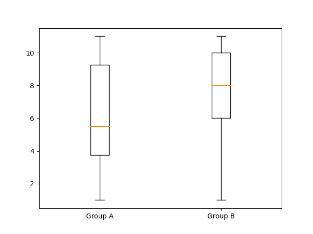

Now it is clear that the two datasets have different distributions, despite having different numbers of points and the same range. Specifically, Group B has more points between 8 and 10 than Group A, putting its median and first quartile higher.

### Heatmaps and Images

Sometimes we have *field* data where there is a specific value for each point along a two dimensional grid. The most common example of field data is a digital image, but we can look at any 2D array as a field. We can visualize fields using a heatmap with `plt.imshow(im)`

```
data = np.array([
	[0,1,2,3,2,1,0],
	[1,2,3,4,3,2,1],
	[2,3,4,5,4,3,2],
	[1,2,3,4,3,2,1],
	[0,1,2,3,2,1,0]
])
plt.imshow(data)
```

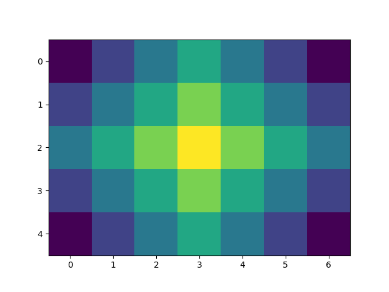

This is using the colormap "viridis" again, just like the scatterplot, which maps low numbers to purple and high numbers to yellow. Notice how the axis ticks show the indices of the array. We can add a colorbar by capturing the return value of imshow and passing it to `plt.colorbar()`:

```
data = np.array([
	[0,1,2,3,2,1,0],
	[1,2,3,4,3,2,1],
	[2,3,4,5,4,3,2],
	[1,2,3,4,3,2,1],
	[0,1,2,3,2,1,0]
])
im = plt.imshow(data)
plt.colorbar(im)
plt.show()
```

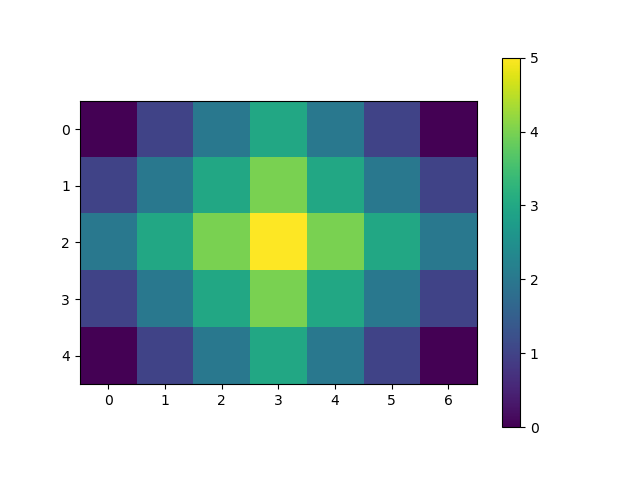

If we want to use a different colormap, we can pass it into the `imshow` function using a keyword argument: `cmap`:

```
data = np.array([
	[0,1,2,3,2,1,0],
	[1,2,3,4,3,2,1],
	[2,3,4,5,4,3,2],
	[1,2,3,4,3,2,1],
	[0,1,2,3,2,1,0]
])
im = plt.imshow(data, cmap='magma')
plt.colorbar(im)
plt.show()
```

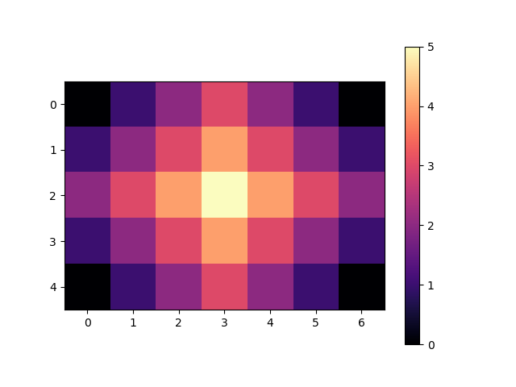

As we will explore in Chapter {{images}}, a color photograph is typically stored as a 3D numpy array of shape (height, width, 3), where the 3 indicates three dimensions of color: red, green and blue. If you have an image file on your computer, you can read it in to Python using matplotlib's `plt.imread()` function. I'm going to demonstrate using this using [this photo of my pet rabbit, Cornelius](../assets/images/test_image.jpg)

```
image = plt.imread('test_image.jpg')
print(image.shape)
plt.imshow(image)
```

Out: (768, 1024, 3)

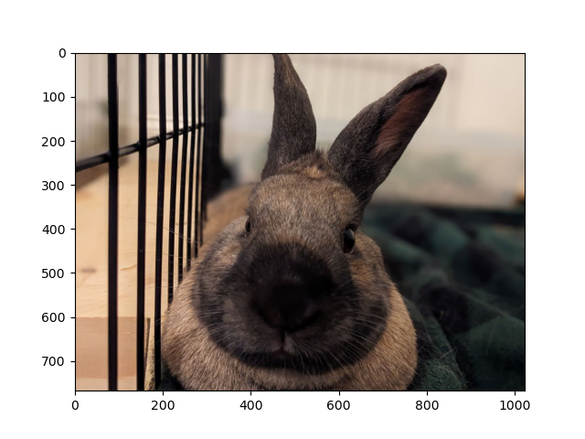

Notice that the dimensions are still listed along the axes.

## Colors

A huge part of data visualization involves color because the human visual system is built to notice differences in color. 

### Digital Color Representations

A digital color is represented as an ordered triple: (R,G,B) of integers between 0 and 255 where the first element encodes red, the second encodes green and the third encodes blue. These are often written using *hex codes* using base 16 numbers. 

<details><summary>About bases</summary>
When we write numbers, we use base 10. That means there are 10 possible digits, and each successive place increases the value of that digit by a power of 10. For example: 23 means 2 * 10 + 3 * 1. Base 16 means there are 16 possible digits, which we write as 0-9 as well as a for 10, b for 11, c for 12, d for 13, e for 14 and f for 15. So the number b4 in base 16 means 11 * 16 + 4 * 1, which in decimal is written as 180.
</details>

For example, (106, 172, 226) is a lovely desaturated blue color. It is typically written as `#6aace2`. 6a encodes 106 because 6 * 16 + 10 = 106. Similarly, ac encodes 172 and e2 encodes 226.

We can specify colors to matplotlib to change the color of chart elements in one of three ways:

* Using a color name, such as "red" or "black" (run `matplotlib.colors.CSS4_COLORS` for a list)
* Using a tuple of color values, rescaled to fall between 0 and 1 instead of 0 and 256
* Using a string containing a hexcode starting with a hash symbol (#)

For example:

```
fig, ax = plt.subplots(1,3,figsize=(16,4))
ax[0].plot([0,1], color='green')
ax[1].plot([0,1], color=(0.6,0.95,0.65))
ax[2].plot([0,1], color='#6aace2')
```

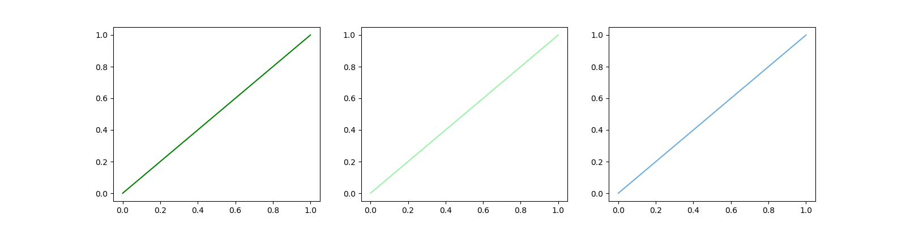

Each of these axes has the same plot in a different color.

### Colormaps

Sometimes, we want to use color to encode continuous characteristics, for example, in a heatmap. The section on heatmaps shows two colormaps: viridis and magma. These are continuous functions which map data values to colors. A list of all the matplotlib colormaps is available online: https://matplotlib.org/stable/users/explain/colors/colormaps.html

We can use colormaps on any matplotlib function with a `c=` argument. For example, in the `scatter` function:

```
data_x = np.arange(10)
data_y = 20 - data_x**2
data_z = np.random.normal(0, 1, 10)
plt.scatter(data_x, data_y, c=data_z, cmap='spring')
```

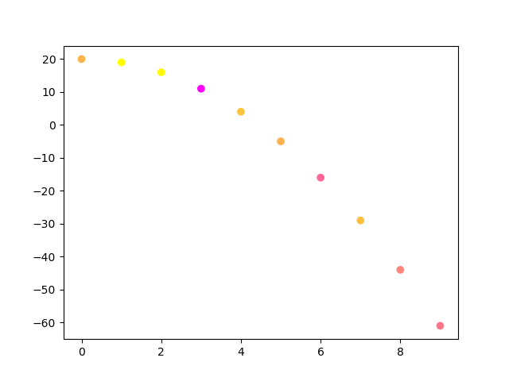

The default colormaps 'viridis', 'plasma', 'inferno', 'magma' and 'cividis' are guaranteed to be *perceptually uniform* meaning that the colors change at approximately the same rate (for typical human perception) across the colormap. They are also colorblind-friendly, so people with colorblindness can also tell all the colors apart. This is a useful property, so when in doubt, try to choose one of these six default colormaps.