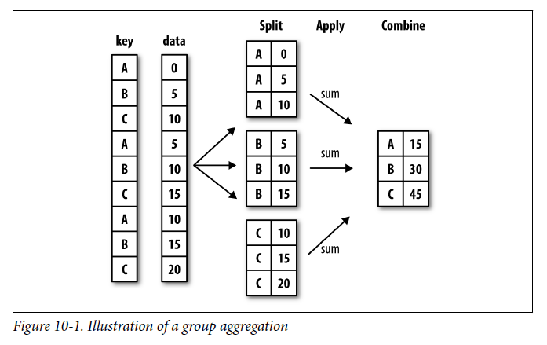

In Chapters {{site.chapter_numpy}} and {{site.chapter_pandas}}, we introduced Boolean masking for arrays and dataframes as a way to select specific rows for analysis. In this chapter, we will expand that concept of indexing and introduce several other ways to select, group and connect dataframes.

## Fancy Indexing

In the following examples, let's say we have a dataframe:

```python
df = pd.DataFrame({
    'name': ['Sam', 'Emma', 'Josh', 'Natasha', 'Adam'],
    'age': [20,19,21,22,23],
    'grade': [85,95,88,85,80]
})
df
```

Out: 

```
	name 	age grade
0 	Sam 	20 	85
1 	Emma 	19 	95
2 	Josh 	21 	88
3 	Natasha 22 	85
4 	Adam 	23 	80
```

### Review: Pandas Indexing

Recall that we index dataframes using square brackets. If we wanted the "age" column:

```python
df['age']
```

Out:

```
0    20
1    19
2    21
3    22
4    23
Name: age, dtype: int64
```

And then we could get row 0 of the age column using two sets of brackets:

```python
df['age'][0]
```

Out: `20`. The first part gets the series, and the second square bracket gets an element of the series.

We can also slice using this approach:

```python
df['age'][1:3]
```

Out:

```
1    19
2    21
Name: age, dtype: int64
```

If we want to slice in multiple directions, for instance, get age and grade for these two students, or get any fancier than that, we need to use `.loc` syntax, which uses numpy-style (row first) indexing, with two indices in the same square brackets separated by commas:

```python
df.loc[1:3,'age':'grade']
```

Out:

```
 	age grade
1 	19 	95
2 	21 	88
3 	22 	85
```

### Masking

If we use a boolean operation on a dataframe column, we can generate a boolean mask:

```python
mask = df['grade'] > 85
mask
```

Out:

```
0    False
1     True
2     True
3    False
4    False
Name: grade, dtype: bool
```

And then we can use that to index:

```python
df[mask]
```

Out:

```python
	name 	age grade
1 	Emma 	19 	95
2 	Josh 	21 	88
```

Notice that the index of the original dataframe is preserved, so to get the first row of these results, we would have to do `[1]`, not `[0]` (or more generally `.head(1)`).

If we have two or more masks, we can combine them using bitwise operators "and" (`&`) and "or" (`|` the pipe character above the enter key). For example:

```python
mask1 = df['grade'] > 85
mask2 = df['age'] > 22
combined_mask = mask1 | mask2
df[combined_mask]
```

Out:

```
 	name 	age grade
1 	Emma 	19 	95
2 	Josh 	21 	88
4 	Adam 	23 	80
```

We can also invert a mask using the "not" operator (`~` above the tab key on your keyboard).

```
mask1 = df['grade'] > 85
mask2 = df['age'] > 22
combined_mask = mask1 & (~mask2)
df[combined_mask]
```

Out:

```
	name 	age grade
1 	Emma 	19 	95
2 	Josh 	21 	88
```

Because Emma and Josh's grades are higher than 85 and their ages are *not* greater than 22.

**Note:** These masks can be used in-line as well, without including a variable. But if you do that, make sure to use parentheses, as Python's order of operations puts binary operators *above* comparisons:

```python
mask = df['grade'] > 85 & ~df['age'] > 22
```

This code will produce an error. Instead, use this code:

```python
mask = (df['grade'] > 85) & ~(df['age'] > 22)
```

Or just split it onto multiple lines using variables like we did above.

### List indexing

We can also select nonconsecutive indices by using a list of indices.

```python
df['age'][[2,4]]
```

Out:

```
2    21
4    23
Name: age, dtype: int64
```

This selects rows 2 and 4 from the age column. Make sure you have a list within the square brackets (i.e. two sets of square brackets) otherwise you'll get an error.

Or in Numpy:

```python
arr = np.array([[1,2,3,4,5], [6,7,8,9,10]])
arr[:,[1,2]]
```

Out:

```
array([[2, 3],
       [7, 8]])
```

We can use list indexing to reorder dataframes or arrays:

```python
df['age'][[4,2]]
```

Out:

```
4    23
2    21
Name: age, dtype: int64
```

This is particularly useful in combination with `np.nonzero(arr)`, which finds the indices of all nonzero elements. E.g. if we wanted to find the mean of all the nonzero elements of an array:

```
arr = np.array([[1,0,3,0,0], [6,0,8,9,0]])
arr[np.nonzero(arr)].mean()
```

Out: `5.4`, which is the mean of 1, 3, 6, 8 and 9.

## Groupby

A common pattern in data analysis is computing summary statistics for each group in a larger dataset. Pandas has a function to speed this process along: `df.groupby('column')`. This function is very powerful, but is a little difficult to use because of its return value.

Let's say we have a dataframe with a key variable and a data variable:

```python
df = pd.DataFrame({
    'key': ['A', 'B', 'C', 'A', 'B', 'C', 'A', 'B', 'C'],
    'data': [0,5,10,5,10,15,10,15,20]
})
```

When we call groupby on this dataframe, we get a "groupby object"

```python
df.groupby('key')
```

Out: `<pandas.core.groupby.generic.DataFrameGroupBy object at 0x000002A06266E690>`

In order to actually see the groups, we need to aggregate them somehow. We can do that to the groupby object directly:

```python
df.groupby('key').sum()
```

Out:

```
 	data
key 	
A 	15
B 	30
C 	45
```

In other words, we've split the data up by value in the column `key` and then summed the elements of each group.

The most helpful way to understand this analysis is through this figure from Wes McKinney's book:



We can also use a Python structure called a *for loop* to run code on each group:

```python
for value, group in df.groupby('key'):
    print(group)
```

Out:

```
  key  data
0   A     0
3   A     5
6   A    10
  key  data
1   B     5
4   B    10
7   B    15
  key  data
2   C    10
5   C    15
8   C    20
```

This loop syntax is very general: we can do basically any data manipulation on these group dataframes.

Groupby can also be used on multiple columns if a list of column names is passed.

## Pivots

Another common pattern in data analysis is that we have "long-form data" with several key columns and a value column, and want to reshape it into "wide-form data" with one of the two keys as the column names. For example:

```python
df = pd.DataFrame({
	'Day': [1,2,3,4,5,6,1,3,4,5,6,7,1,2,3,5,6,7],
	'Associate': ['Alice', 'Alice', 'Alice', 'Alice', 'Alice', 'Alice', 
                  'Bob', 'Bob', 'Bob', 'Bob', 'Bob', 'Bob',
                  'Carol', 'Carol', 'Carol', 'Carol', 'Carol', 'Carol'],
    'Sales Total': [150, 120, 100, 105, 102, 160, 80, 85, 88, 90, 92, 100, 90, 95, 102, 108, 105, 140]
})
df
```

Out:

```
	Day	Associate Sales Total
0 	1 	Alice 	  150
1 	2 	Alice 	  120
2 	3 	Alice 	  100
3 	4 	Alice 	  105
4 	5 	Alice 	  102
5 	6 	Alice 	  160
6 	1 	Bob 	  80
7 	3 	Bob 	  85
8 	4 	Bob 	  88
9 	5 	Bob 	  90
10 	6 	Bob 	  92
11 	7 	Bob 	  100
12 	1 	Carol 	  90
13 	2 	Carol 	  95
14 	3 	Carol 	  102
15 	5 	Carol 	  108
16 	6 	Carol 	  105
17 	7 	Carol 	  140
```

This is long-form because each row is an "entry" with properties represented by columns. We can use .pivot to reshape it into wide-form data:

```python
df.pivot(columns='Associate', index='Day', values='Sales Total')
```

Out:

```
Associate 	Alice 	Bob 	Carol
Day 			
1 	        150.0 	80.0 	90.0
2 	        120.0 	NaN 	95.0
3 	        100.0 	85.0 	102.0
4 	        105.0 	88.0 	NaN
5 	        102.0 	90.0 	108.0
6 	        160.0 	92.0 	105.0
7 	        NaN 	100.0 	140.0
```

Now, the columns do not represent properties of entries, each row represents a day and each column represents an associate. Notice that missing combinations, instead of just being absent, are explicitly NaN here.

Note: Pivoting a table with duplicate keys (e.g. if there were two entries for Alice on day 1) causes an error, so aggregate your data with groupby before pivoting!

## Pandas Dates and Times


## Merging and Joining tables


## 