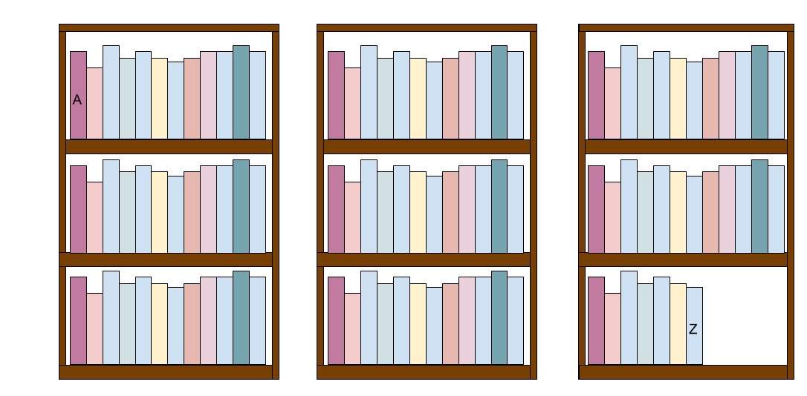
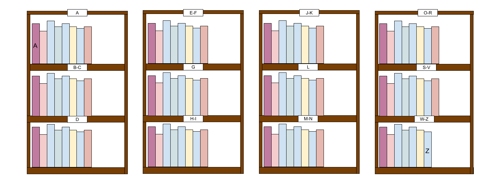

# Chapter 2: Lists and Dictionaries

This page describes a key Python data structure: lists. After exploring lists, we will revisit strings and introduce another data structure: dictionaries.

## Why Data Structures?

In computer science, one of the most fundamental topics is how to organize data. In fact, computer science majors take an entire class on this topic where they learn the costs and benefits of different organizational strategies. To explore this concept, let's use an example.

Imagine I'm working at a library and the shelves are alphabetized from A to Z like so:



Now, what happens when I add a book to the As? I have to move a book down a shelf, then move a different book down another shelf, then move another book across to the next set of shelves, and on and on. If I'm shelving 100 books, that turns into a huge amount of work!

What if, instead, we organize the books into more shelves, with fewer books per shelf?



This takes up more space, but when we add books at the start of the alphabet, we only have to move a few books out of the way, and we don't have to transfer books from shelf to shelf. Now, we can also split the work between multiple shelvers. Eventually, if too many books end up on one shelf, we may have to shift some books around to rebalance the shelves, but that won't happen very often.

How did we avoid doing so much work? We used a different data structure. Instead of putting all of the books in a list together, we organized them into alphabetic categories. Now, local changes to one category don't affect the other categories.

## Lists

The first data structure we're going to use in Python is a list. Lists are declared using square brackets [] with the elements separated by commas.

```python
my_list = [1,3,5]
```

Notice that they are treated just like any other data type and assigned to a variable.

<details>
    <summary>A note about bracket symbols</summary>
    The names for [], (), {},< > and "" vary around the world. In these notes I use the following terms for them:
    <ul>
    <li>() are called "parentheses"</li>
    <li>[] are called "brackets" or "square brackets"</li>
    <li>{} are called "braces" or "curly braces"</li>
    <li><> are called "angle brackets"</li>
    <li>"" are called "quotes" or "double quotes"</li>
    </ul>
</details>

### Indexing Lists

Each element of the list (the integers 1, 3 and 5 in the list above) is associated with a specific *index value*. For historical reasons, lists are *zero-indexed*, which means the first element has an index of 0.

| Index | Element |
| ----- | ------- |
| 0     | 1       |
| 1     | 3       |
| 2     | 5       |

We can access the elements of the list using *square bracket notation*:

```python
my_list = [1,3,5]
my_list[1]
```

Out: `3` because the element in position 1 is 3.

Square bracket notation also works on strings:

```
name = "Samuel Goree"
initials = name[0] + name[7]
initials
```

Out: `SG`

### Modifying Lists

We can assign to the elements of lists:

```
my_list = [1,3,5]
my_list[1] = 2
my_list
```

Out: `[1, 2, 5]`. Notice the 3 has changed to a 2 because we assigned to it.

Note that this does not work on strings.

### Calling Functions on Lists

#### len()

Just like we can call functions on strings and integers, we can call functions on lists. One of these functions we already know:

```python
lst = [2,4,6,8]
length = len(lst)
length
```

Out: `4`, because there are four elements in the list.

#### sum()

Another useful function for data science is the `sum` function, which adds up all the numbers in a list:

```
lst = [2,4,6,8]
total = sum(lst)
total
```

Out: `20` because 2 + 4 + 6 + 8 is 20.

#### sorted()

Functions can also return lists. For example, the sorted() function takes a list as an argument and returns a copy of that list, sorted from smallest to largest.

```
lst1 = [1,3,6,2,4,7,5]
lst2 = sorted(lst1)
print(lst1, lst2)
```

Out: `[1, 3, 8, 2, 4, 9, 5] [1, 2, 3, 4, 5, 6, 7]`Notice that in lst1, the order is preserved while lst2 is sorted.

#### reversed()

A function that returns a reversed version of a list.

```
lst1 = [1,3,5,2,4]
lst2 = reversed(lst1)
print(lst1, lst2)
```

Out: `[1,3,5,2,4] [4,2,5,3,1]`

## List Methods

Lists also have another kind of function associated with them, called a *method*. Methods are just like functions, except they are called using the dot operator `list_name.method_name()`. The "dot" indicates that the method `method_name` is operating on the list `list_name`. While functions and methods work the same way, there is an idiomatic difference: functions generally don't modify their arguments, but methods often modify the thing they are operating on (e.g. `method_name` might change the internal data of `list_name`).

#### .append()

A perfect example of this behavior is the append method, which appends a new value to the end of a list.

```
lst = [1,2,3]
lst.append(4)
lst
```

Out: `[1, 2, 3, 4]`. Notice how we didn't create a new list, we modified `lst`.

#### .sort()

Another method is the .sort() method. This doesn't return a new list, instead it sorts a list *in-place*, overwriting the original list.

```
lst = [1,3,6,2,4,7,5]
lst.sort()
lst
```

Out: `[1, 2, 3, 4, 5, 6, 7]`. Notice `lst1` has changed and is now sorted.

The .sort method does not return a value. That means if you try to use it like sorted(), it won't work.

```
lst1 = [1,3,6,2,4,7,5]
lst2 = lst1.sort()
lst2
```

If you run this code, the output is blank. If you run `print(lst2)` it will show `None`. That means lst2 doesn't actually contain a list. None is Python's null type, it has no type and no data. If a method returns nothing, it literally returns `None`.

#### .reverse()

Just like .sort, .reverse reverses a list in-place.

```
lst = [1,2,3]
lst.reverse()
lst
```

Out: `[3,2,1]`

## String Methods

In Chapter {{chapter_}}