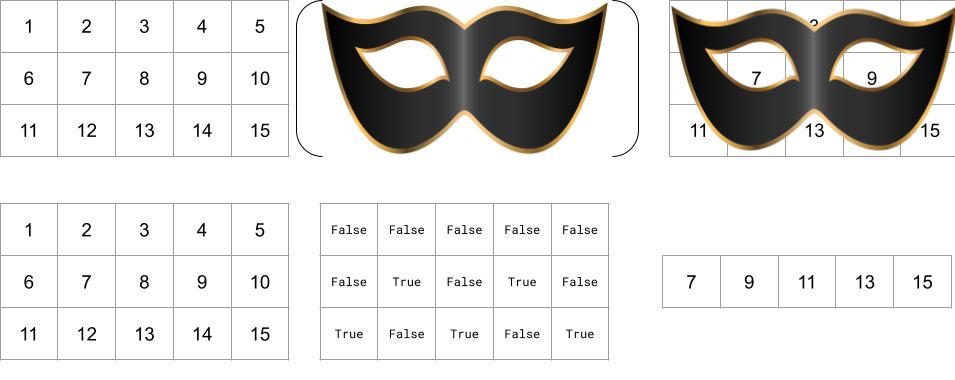
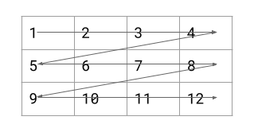

# Chapter 3: Numpy

This page describes the Python library Numpy, short for Numerical Python and usually pronounced "nuhm-pie." Numpy is a framework for numerical computing which allows Python programs to run much faster code from older C++ and Fortran libraries such as [lapack](https://netlib.org/lapack/) and [libfft](https://github.com/pyroesp/libFFT). which serves as the foundation for the entire Data Science Python Stack.

## Importing Python Libraries

Python is a general-purpose programming language. While it has some built-in functions, it lacks most of the operations that we want to do in data science. To make Python into a data science program, we have to import external libraries which are designed for this purpose.

### Example: math

The `math` library contains mathematical constants and functions. For example, if we wanted to compute the area of a circle from its radius:

```python
import math
radius = 6
area = math.pi * radius ** 2
area
```

Out: `113.09733552923255`

In the first line, we use the `import` keyword to import the math library. We can then access the mathematical constant Pi (3.1415...) and use it in our (hopefully familiar) calculation: 
$$
a = \pi r^2
$$

The math library also includes an important and familiar function: the logarithm. Recall that the logarithm is the inverse of the exponential. So if
$$
a = b^c = \exp_b(c)
$$
Then
$$
c = \log_b(a)
$$
In Python:

```python
import math
a = 10
b = 10
c = math.log(a, base=b)
print(c)
```

Out: `1`, as 10^1 = 10.

```python
a = 256
b = 2
c = math.log(a, base=b)
print(c)
```

Out: `8`, as 2^8 = 256.

 The logarithm function is called on a number with an optional second argument of a base. By default, the base of `log` is *e*, a mathematical constant equal to 2.718... Typically, computer scientists treat all log bases as mostly interchangeable, as every log function differs from the others by a constant multiplier. In formal terms, for each pair of bases b1, b2 there exists a constant C such that
$$
\log_{b_1}(a) = C \log_{b_2}(a)
$$
Logarithms are one of the most useful tools we have in data science, and they will come up over and over again.

### Example: datetime

Another Python library that is quite useful is the `datetime` library. This library contains several functions for working with dates and times. For example, if we want to know the current time:

```python
from datetime import datetime
right_now = datetime.now()
```

Out: `datetime.datetime(2024, 6, 10, 15, 41, 12, 599871) `

The first line of code uses the `import` keyword (which we discuss in the next section) to import the datetime module from the datetime library. The second line calls the `now()` function from the datetime module which returns an object representing the current time.

This is a datetime.datetime object representing a specific moment in time. It shows seven numbers associated with my current time. I wrote the first draft of this chapter on June 10th 2024 at 3:41pm and 12.599871 seconds.

### Three Kinds of Imports

There are three ways of importing Python libraries. All of them use the `import` keyword and the name of a library, but they have subtle differences.

1. `import libraryname`. This imports libraryname. We can access its elements using `libraryname.functionname`. For example:

   ```
   import math
   math.sin(math.pi / 2)
   ```

   Out: `1.0`

2. `import libraryname as lbn`. This imports libraryname, but renames it to a shorthand, in this case, lbn. We can access its elements using the shorthand, which saves a lot of keystrokes. For example:

   ```python
   import datetime as dt
   half_past_noon = dt.time(12,30,0)
   ```

   Out: `datetime.time(12,30)`, a time object corresponding to 12:30pm.

3. `from libraryname import functionname`. This only imports a specific function, functionname, from libraryname. We can access functionname by calling it directly, without the need for the library name. For example:

   ```python
   from datetime import time
   half_past_noon = time(12,30,0)
   ```

   A majority of the imports we will do in data science will be of the second type.

## The Data Science Python Stack

In computer science, we refer to a collection of programming tools that build on each other a "tech stack." In data science, we use the "Data Science Python" stack. This is a collection of open source Python libraries that build on one another.


(Source: https://chris35wills.github.io/courses/pydata_stack/)

You're already familiar with Python and Jupyter. IPython is a program that Jupyter uses to run your code interactively (that's why they're called IPython Notebooks, or .ipynb files). In this chapter, we are covering Numpy. In Chapter {{chapter_pandas}} we will talk about Pandas. In {{chapter_matplotlib}}, we will talk about Matplotlib and mention Seaborn. In {{chapter_regression}} we will use tools from Scipy and scikit-learn, and reference StatsModels.

## Importing Numpy

We will import the numpy library using a common shorthand:

```python
import numpy as np
```

This allows us to use the features of the numpy library by writing `np.something`. We typically put this line of code (along with all other import statements) in a cell at the top of our notebook. For the rest of the chapter, we will be assuming this line of code has been run already.

## Numpy Arrays

Numpy's central contribution is a new data structure called a N-dimensional array. We can make n dimensional arrays from Python lists:

```python
lst = [1,1,1,2,2,2]
arr = np.array(lst)
arr
```

Out: `array([1, 1, 1, 2, 2, 2])`

The key feature of numpy arrays is their ability to represent nested lists and operate on them efficiently. 

```
nested_list = [[1,2], [3,4], [5,6]]
arr = np.array(arr)
```

Out:

```python
array([[1,2],
       [3,4],
       [5,6]])
```

By convention, we describe the outer array as "rows" and the inner array as "columns" and arrange the array in a grid, as shown above.

Numpy manages to do that by imposing two key restrictions on its arrays.

1. Numpy arrays must only contain elements of a single data type (e.g. int, float)
2. Nested numpy arrays must all have the same length.

For example:

```
invalid_array = [1, 'a']
invalid_2d_array = [[1,2], [1]]
```

Both `invalid_array` and `invalid_2d_array` are valid Python lists, but would be invalid if converted to Numpy arrays. `invalid_array` is an invalid numpy array because it contains mixed data types, but it would not cause an error, as numpy will cast both types to "object". `invalid_2d_array` is actually invalid and will result in an error.

### Indexing Numpy Arrays

We can access individual elements of a numpy array using the same square bracket notation from Python lists.

```
arr = np.array([1,3,5,7,9])
arr[3]
```

Out: `7`

Instead of using multiple indices, we can index multidimensional numpy arrays using indices separated by commas.

```
lst = [[1,2,3],[4,5,6],[7,8,9]]
arr = np.array(lst)
lst[1][2], arr[1,2]
```

Out: `6, 6`, indicating that both expressions are equivalent.

We refer to 1 as the index along the 0th *axis* (the row number) and 2 as the index along the 1st axis (the column number). An axis is a dimension of a multidimensional array.

### Slicing Numpy Arrays

Just like we can slice Python lists using a `:` inside their indices, we can slice Numpy arrays. For example:

```
arr = np.array([[1,2], [3,4], [5,6]])
arr[:2]
```

Out: `array([[1,2], [3,4]])`. We have sliced from index 0 up to but not including 2 in the 0th axis, so we get the first two subarrays.

We can also slice along one axis and index along another. For example:

```
arr = np.array([[1,2,3],[4,5,6],[7,8,9]])
arr[1,1:]
```

Out: `array([5, 6])`. Notice that the slice is one-dimensional because we indexed along the 0th axis and sliced along the 1st axis of a 2D array.

We can even slice along several axes simultaneously:

```
arr = np.array([[1,2,3],[4,5,6],[7,8,9]])
arr[:2,2:]
```

Out: 

```
array([[3],
       [6]])
```

Notice that the new array is two-dimensional because we sliced along both axes, even though the 1st axis only has one element (a slice from 2 to the end in an axis with length 3).

### Boolean Masking

Numpy also supports what is called "masking" where we index one array using a second array of `True` and `False`. In computer science, True and False are called "Booleans" after the 19th century mathematician George Boole who studied them. 

For example:

```
arr = np.array([1,2,3,4,5,6,7,8])
mask = np.array([True,False,True,False,False,True,False,False])
arr[mask]
```

Out: `array([1, 3, 6])`

We can think of a boolean mask like a paper mask with holes cut in it:



We can generate boolean masks by using true/false statements about arrays:

```python
data = np.arange(100)
mask = ((data // 10) == 3)
data[mask]
```

Out: `array([30, 31, 32, 33, 34, 35, 36, 37, 38, 39])`

Here, we use integer division to divide each element of `data` by 10, use the boolean operator `==` to check if the result is equal to 3. This effectively checks whether the first digit is 3. Equivalently, we can put the boolean mask inside the brackets:

```python
data = np.arange(100)

data[((data // 10) == 3)]
```

Out: `array([30, 31, 32, 33, 34, 35, 36, 37, 38, 39])` (the same result)

### Shape

Just like we can use the `len()` function on lists to find their length, we can find the length of a Numpy array.

```
lst = [[1,2],[4,5],[7,8]]
arr = np.array(lst)
len(arr)
```

Out: `3`, since the length of the outer list is 3.

Additionally, since all valid numpy arrays have same-length nested arrays, we can see those lengths as well using a property called .shape

```python
lst = [[1,2],[4,5],[7,8]]
arr = np.array(lst)
arr.shape
```

Out: `(3,2)`, because the outer array has length 3 and each inner array has length 2. Notice that shape is a property, not a method. It is called without parentheses.

It is helpful to think about these arrays as rectangles:

| Indices | 0    | 1    |
| ------- | ---- | ---- |
| 0       | 1    | 2    |
| 1       | 4    | 5    |
| 2       | 7    | 8    |

The shape is the length by the width.

One dimensional arrays of length n have shape `(n,)`. The comma is included to show that it is still a tuple. Notice the length of an array's shape yields its dimensionality.

Shape scales to higher dimensional arrays as well:

```python
three_dimensional_arr = np.array([
    [
        [14, 12],
        [20,  6],
        [11, 24]
    ],[
        [ 9, 16],
        [ 8, 19],
        [ 2, 10]
    ],[
        [22, 21],
        [ 4,  1],
        [13,  3]
    ],[
        [15, 18],
        [ 5, 23],
        [ 7, 17]
    ]
])
three_dimensional_arr.shape
```

Out: `(4, 3, 2)` The 4 refers to the outer array with four subarrays. The three refers to each subarray with three subarrays. The 2 refers to each array of length two containing integers.

Notice that the product of the shape (4 * 3 * 2) yields the total number of elements (24). In our rectangle analogy, this is the volume of a solid prism.

### Flattening Arrays

Given a high-dimensional array, we can *flatten* the array into a one-dimensional array using the `.flatten()` method.

```python
flat_arr = three_dimensional_arr.flatten()
flat_arr
```

Out: `array([14, 12, 20, 6, 11, 24, 9, 16, 8, 19, 2, 10, 22, 21, 4, 1, 13, 3, 15, 18,  5, 23, 7, 17])`

The shape of the flat array is the product of the shape of the original array:

```
flat_arr.shape
```

Out: `(24,)`. The shape is still a tuple, since shapes are always tuples, but now it is length 1 because the array is one-dimensional.

### Reshaping Arrays

We can also *reshape* an array into a new shape. Since the new array will be filled with the same values as the old array, the new shape must have integer dimensions which have the same product as the original shape. The order in which elements are added to the new array is the same as the order they occur in while flattened. This order moves quickly over the inner dimensions and slowly over the outer dimensions:



For example:

```python
three_dimensional_arr.reshape([8,3])
```

Out:

```
array([[14, 12, 20],
       [ 6, 11, 24],
       [ 9, 16,  8],
       [19,  2, 10],
       [22, 21,  4],
       [ 1, 13,  3],
       [15, 18,  5],
       [23,  7, 17]])
```

Notice how the order remains the same as long as you go through the dimensions from smallest to largest: 14, 12, 20, ... rather than 14, 6, 9 ...

If you try to reshape an array into an invalid shape, Numpy will throw a ValueError. For example, if I try to reshape this array into shape (5,4), that won't work because 5 * 4 = 20, not 24. The error message looks like this:

```
---------------------------------------------------------------------------
ValueError                                Traceback (most recent call last)
Cell In[38], line 1
----> 1 three_dimensional_arr.reshape([5,4])

ValueError: cannot reshape array of size 24 into shape (5,4)
```

If we are unsure of the shape of our array ahead of time, we can use -1 as a placeholder for "whatever value makes the shape work." For example:

```python
three_dimensional_arr.reshape([2,2,2,-1])
```

Out:

```
array([[[[14, 12, 20],
         [ 6, 11, 24]],

        [[ 9, 16,  8],
         [19,  2, 10]]],


       [[[22, 21,  4],
         [ 1, 13,  3]],

        [[15, 18,  5],
         [23,  7, 17]]]])
```

Numpy infers that a (4,3,2) shape array should be reshaped into a (2,2,2,3) shape array because the product must remain 24. 

### dtype

Another property of numpy arrays which is potentially relevant to data science is their data type, which we can access through the `.dtype` property. Since all of the values inside an array are of the same type, we can check that type for the full array. Numpy uses very specific types from C++ to describe its arrays, such as:

* uint8: an *unsigned* 8 bit integer: an int which can only hold values from 0 to 255 and cannot be negative.
* int32: a signed 32 bit integer: an integer which can range from -2^31 to 2^31, this is similar to Python's normal int type
* float64: a 64 bit floating point type, which can represent values as small as 2^-1075 and as large as 2^1075.

In these types, the information capacity of the number is specified in *bits*. Bits are binary digits, either 0 or 1. In general, a n-bit binary representation can hold 2^n possible values, since each bit is either 0 or 1. From this lens, integer and float are just different ways of arranging those 2^32 or 2^64 different possible values along the number line which are useful for different tasks.

### Changing Array Types

We can change 

## Ways to Create Numpy Arrays

As we have seen, we can create numpy arrays from Python lists. There are several other ways to create arrays which do not require typing out all of the elements first.

* `np.zeros(shape)`: create an array of zeroes with the given shape and dtype. For example:

  ```python
  zero_mat = np.zeros((3,4), dtype='uint8')
  zero_mat
  ```

  Out:

  ```python
  array([[0, 0, 0, 0],
  	   [0, 0, 0, 0],
         [0, 0, 0, 0]], dtype=uint8) 
  ```

* `np.ones(shape)`: Create an array of ones with the given shape and dtype. For example:

  ```python
  one_mat = np.ones((2,2), dtype='float64')
  one_mat
  ```

  Out:

  ```python
  array([[1., 1.],                                                                                                                    [1., 1.]]) 
  ```

* `np.zeros_like(arr)`, `np.ones_like(arr)`: Create an array of zeroes or ones, respectively, that is the same shape and dtype as the given array. For example:

  ```python
  my_matrix = np.array([[1,2,3],[4,5,6]])
  zero_matrix = np.zeros_like(my_matrix)
  ones_matrix = np.ones_like(my_matrix)
  print(zero_matrix)
  print(ones_matrix)
  ```

  Out:

  ```python
  array([[0 0 0]
         [0 0 0]])
  array([[1 1 1]
         [1 1 1]])
  ```

* `np.arange(start=0, stop, step=1)`: Create an array which ranges from `start` to `stop`, counting up by `step`, similar to the Python `range` function. Notice that start and step have default values, so you can call this function in several different ways. The size of the array will be `(stop - start) // step`. For example:

  ```python
  arng1 = np.arange(5)
  arng2 = np.arange(3,6)
  arng3 = np.arange(10,50,10)
  print(arng1)
  print(arng2)
  print(arng3)
  ```

  Out:

  ```python
  array([0 1 2 3 4])
  array([3 4 5])
  array([10 20 30 40])
  ```

* `np.linspace(start, stop, num=50)`: Create an array which ranges from `start` to `stop` with `num` elements, spaced evenly or *linearly* (linspace, short for linear space). Unlike `arange`, `linspace` includes the `stop` value. The step size will be `stop - start / (num-1)`. For example:

  ```
  ls = np.linspace(0, 10, 10)
  ls
  ```

  Out:

  ```
  array([ 0.        ,  1.11111111,  2.22222222,  3.33333333,  4.44444444,
          5.55555556,  6.66666667,  7.77777778,  8.88888889, 10.        ])
  ```

  The array contains 10 values, evenly spaced between 0 and 10. The step size, therefore, is 10/9 or 1.111...

* `np.eye(size)` generates an array of shape `(size, size)` with ones in the diagonal and zeros elsewhere. In linear algebra this is called I, the identity matrix (hence the name "eye"). For example:

  ```
  identity_mat = np.eye(3)
  identity_mat
  ```

  Out: 

  ```
  array([[1., 0., 0.],
         [0., 1., 0.],
         [0., 0., 1.]])
  ```

### Saving and Loading Arrays from Text Files

If we have a Numpy array and want to save it for use in another program, there are a couple ways we can do that:

* `np.savetxt(fname, X, delimiter=' ', header='')` Save a one or two dimensional array as plaintext to a file. Delimiter specifies the *delimiter*, a character that separates numbers from each other. For example in "1,2,3,4" the comma is the delimiter. `header` specifies a string to put at the start of the file, for example, the names of data columns.
* `np.save(fname, arr)` Save an array of any dimension as binary to a file. Traditionally, we use the file extension `.npy` for numpy arrays saved in this manner.

If we want to load an array from a file there are also a couple ways we can do that:

* `np.loadtxt(fname, delimiter=' ', skiprows=0)` Load a numpy array from a text file. Delimiter specifies the delimiter which was used to write the file, like in `savetxt`. skiprows indicates the number of rows at the top of the file to skip. 

* `np.load(fname)` Load a numpy array from a binary `.npy` file which was saved with `np.save`.

  For example:

  ```
  arr = np.array([[1, 0, 1],
  				[0, 1, 0],
  				[1, 0, 1]])
  arr.savetxt('myarr.txt', delimiter=',', header='col1,col2,col3')
  arr.save('myarr.npy')
  ```

  The file `myarr.txt` now has the content:

  ```
  col1,col2,col3
  1,0,1
  0,1,0
  1,0,1
  ```

  And `myarr.npy` has the same content, though it is compressed into an unreadable binary file.

* `np.genfromtxt(fname, delimiter=None, skip_header=0, skip_footer=0, missing_values=None, filling_values=None, usecols=None)`: If you encounter a file that you want to read using numpy, but loadtxt is not working for some reason, you can use genfromtxt to handle any weirdnesses in the file. This function has many, many optional arguments. The most useful few are provided here:
  * `delimiter` specifies the delimiter to use. This can be any string. By default, it uses any whitespace as a delimiter.
  * `skip_header` specifies the number of rows to skip at the top of the file.
  * `skip_footer` specifies the number of rows to skip at the end of the file.
  * `missing_values` indicates which strings should be treated as a missing value. You can provide multiple such strings in a list.
  * `filling_values` specifies what should be put in place of each missing value. `np.nan` is a common option, as is `0`, `-1` or `''`.
  * `usecols` specifies which columns of the file to use. This is a useful argument if you have a file mixing number and text data and only want to load the numbers.


Most of the time, you won't need to use `genfromtxt` as we will soon have access to pandas, which is much better at reading data files.

## Vectorized Arithmetic

<details><summary>Review: Vectors</summary>You may have encountered vectors in a prior math or physics course. A vector is a mathematical object that can be represented in three ways: a point in space, a list of coordinates or a direction and a distance. Vectors are one of the basic objects of study in linear algebra and have many uses in data science. For a more comprehensive introduction to vectors, please consult a mathematics textbook, e.g. <a href="https://math.libretexts.org/Bookshelves/Precalculus/Book%3A_Precalculus__An_Investigation_of_Functions_(Lippman_and_Rasmussen)/08%3A_Further_Applications_of_Trigonometry/8.04%3A_Vectors">Lippman & Rasmussen</a>. In these notes, we will represent N-dimensional vectors using numpy arrays of shape (N,). Notice that vectors of any dimension are still one-dimensional arrays.</details>

One of the most powerful features of numpy is its *vectorized* operations, which apply a single mathematical operator to an array element by element. For example:

```
a = np.array([1,2])
b = np.array([4,5])
a + b
```

Out: `array([5, 7])`

Recall this is not how python lists work. For python lists, the + operator is used for concatenation.

The same is true for subtraction, multiplication and division:

```
a - b, a * b, a / b
```

Out: `array([-3, -3]), array([4, 10]), array([0.25, 0.4])`

We can also substitute a scalar (e.g. a Python int or float) into any of these operations:

```
arr = np.array([3,4,5])
arr + 2, arr - 2, arr * 2, arr / 2
```

Out: `(array([5, 6, 7]), array([1, 2, 3]), array([ 6,  8, 10]), array([1.5, 2. , 2.5]))`

Notice that division converts all the elements of the array into floats in order to accurately represent 1.5 and 2.5, displaying 2 as `2.` to show that it is a float.

### Dot Products in Numpy

The multiplication symbol * performs vectorized multiplication:
$$
a = (a_1, a_2,...,a_n)\\
b = (b_1, b_2,...,b_n)\\
a * b = (a_1 * b_1, a_2 * b_2, ..., a_n * b_n)
$$
In linear algebra, this is an unusual vector product. Mathematicians are more familiar with the "dot product" (also called scalar product or inner product):
$$
a \cdot b = a_1b_1 + a_2b_2 + ... + a_nb_n
$$
We can compute the dot product between two one-dimensional numpy arrays using the @ operator

```
a = np.array([2,3])
b = np.array([2,4])
a @ b
```

Out: `16`, as 2\*2 + 3\*4 = 4 + 12 = 16

On two-dimensional arrays, the @ symbol performs matrix multiplication on the last two dimensions. For example:

```
mat_a = np.array([[2,3],[4,5],[6,7]])
mat_b = np.array([[1,-2],[-2,1]])
mat_a @ mat_b
```

Out: `array([[-4, -1], [-6, -3], [-8, -5]]) `
