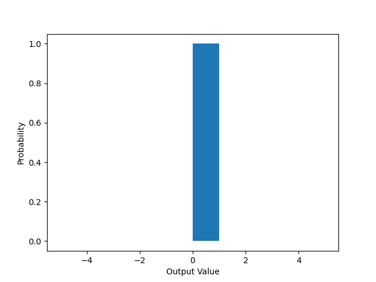
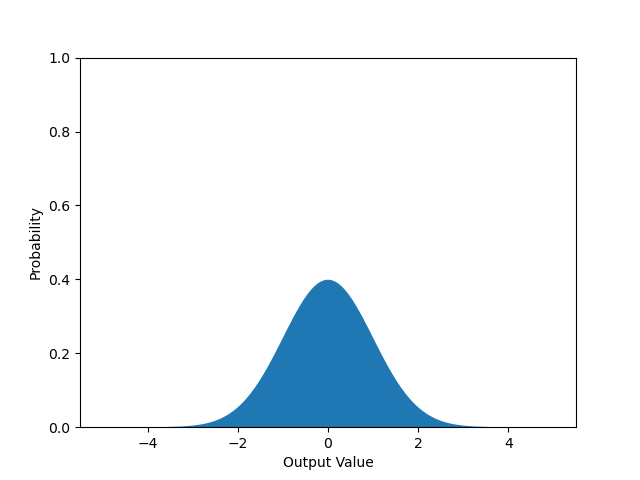
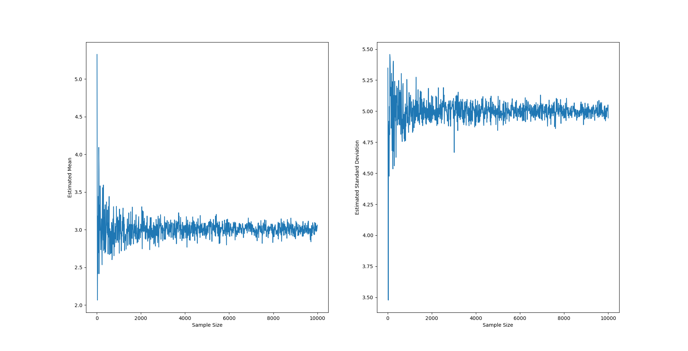

# Chapter 5: Random Numbers and Summary Statistics

This page continues our study of Numpy through its summary statistic functions and random number module.

## Summary Statistics

Imagine you're working in a science lab and collected data representing the heights of bean plants in inches. We enter it into a numpy array:

```python
data = np.array(
    [ 3.174, 17.66 , 15.531, 7.161, 9.449, 7.27, 19.099, 14.031, 14.534, 17.006, 15.542, 12.625, 6.113, 17.634, 11.902, 18.866, 14.264, 15.684, 12.615, 10.471, 14.853, 9.792, 10.204, 20.47, 10.678, 13.397, 24.104, 5.041, 10.467, 18.692, 16.722, 7.283, 5.909, 10.458, 20.511, 13.148, 13.946, 5.642, 12.778, 15.609, 14.553, 16.32, 16.709, 8.162,  5.917, 15.328, 14.09, 15.541, 19.338, 16.609, 14.26, 13.53, 4.889, 13.831, 19.539, 22.351, 12.885, 7.835, 18.078, 17.391, 16.591, 13.072, 12.516, 22.028, 7.276, 20.009,  7.48, 2.46, 18.017, 18.938,  7.135, 22.456, 12.247, 13.428, 22.245, 7.203, 14.993, 15.56, 14.696,  9.598, 9.69, 19.526, 16.333, 8.904, 12.372, 13.002, 7.857, 2.03, 13.767, 13.401, 9.123, 7.19, 16.523, 10.066, 11.733, 21.604, 13.691, 5.275, 9.158, 14.356])
```

If your supervisor asked you: "how are the bean plants growing?" You *could* just read out all of the numbers. But that would probably overload and confuse your supervisor. What might be a better answer?

* There are 100 of them (the *count* or *length*)
* The bean plants range from 2.03 to 24.104 inches (the *range*)
* Half of them are above 13.6105 inches, and half of them are below (the *median*)
* In total, we have grown 1321 inches of bean plant (the *sum*)
* Which means 13.21 inches per bean plant (the *mean*)
* The bean plants vary quite a bit from that average, often more than 5 inches higher or lower (the *standard deviation*)

We call these descriptions *summary statistics* because they summarize lots of data into simple, easy-to-interpret values.

<details><summary>A note on the word "statistic"</summary>While the academic discipline of statistics originated in the 19th century, its name and many of its key ideas go back further, to medieval Islamic and ancient Greek mathematicians. The word "statistics" comes from renaissance Italy, where the name literally means "the science of states" as in countries and their governments. It uses the same construction as other words ending in -ics, like ballistics (the "science of throwing") or cladistics (the "science of classification"). See <a href="https://www.ceeol.com/search/article-detail?id=286384">Walenty Ostasiewicz "The emergence of statistical science"</a> for more information.</details>

Numpy has functions to compute all of these summary statistics and more. For example: 

```python
np.mean(data), np.median(data), np.min(data), np.max(data)
```

Out: `(13.2104, 13.6105, 2.03, 24.104)`

Many of these functions can also be called as methods. For example:

```python
data.mean(), data.min(), data.max()
```

Here, the data must be a numpy array.

## Random Numbers

In daily speech, we often refer to things as "random" because they are arbitrary or erratic (e.g. "I put on a random shirt today" or "you said something so random"). In data science, we do not use the word random like that. When we say something is random, we mean that it is literally chosen *at random* using a totally unpredictable process like a die roll or coin toss.

We can generate a random number using a random number generator object from numpy's random module. For example, using the `random()` function:

```python
import numpy as np
rng = np.random.default_rng()
random_number = rng.random()
random_number
```

When I run this code, it gives me the value `0.23318962558486067`, a randomly chosen float between 0 and 1. But if I run it again, it will give me a different value.

Computers create random numbers using an algorithm called a pseudorandom number generator. These algorithms are only "pseudorandom" since computers are deterministic, meaning that they execute exactly the same code in exactly the same way every time. To make them seem truly random, we start them with a "random seed" which is a number chosen based on an unpredictable process. A common choice for random seed is the CPU temperature mod 1 degree or the current system time in nanoseconds mod 1 millisecond.

If we want to, we can actually set the random seed to a specific value by hand. If we do that, numpy will still seem like it's generating random numbers, but the numbers will all be exactly the same.

We can set the seed with a function `np.random.default_rng(seed=seed_value)`. For example:

```python
rng = np.random.default_rng(seed=10)
not_so_random = rng.random()
not_so_random
```

Out: `0.9560017096289753`. If you run the same code, you will get the exact same output.

<details><summary>About Numpy's random number generator</summary>The specific random number generator that numpy.random uses is called the Mersenne Twister, which uses bitwise arithmetic to generate random numbers in a way which is guaranteed to be difficult to predict without the random seed. This property is important for security reasons, as random number generators are used frequently to come up with cryptographic keys for encrypting sensitive data.</details>

## Random Number Functions

There are several numpy functions which generate random numbers using different *distributions*. The distribution of a random number generator describes how it spreads the randomly generated numbers across the number line. For example, compare these two random number generators:

```python
rng = np.random.default_rng()
rng.random(size=9)
```

Out: `array([0.95600171, 0.20768181, 0.82844489, 0.14928212, 0.51280462, 0.1359196 , 0.68903648, 0.84174772, 0.425509])`

Notice how all of these numbers fall between 0 and 1.

```python
rng.normal(size=9)
```

Out: `array([ 1.27618331, -0.4334134 , 0.83839991, 0.89562287, 1.91182049, -0.18274191, 0.6019141, -0.2705902, -1.2265337])`.

These numbers, on the other hand, go above 1 and below 0, but most of their values are still relatively small.

The difference between these functions is their distributions. Using matplotlib (discussed in chapter {{chapter_matplotlib}}, we can plot the probability of any given number coming out of these generators to see their different distributions:

 

As you can see, for the first function, all the values in between 0 and 1 are equally likely, but for the second function, values around zero are more likely. Interestingly, that second function (`rng.normal`) is *unbounded* meaning it could possibly generate values which are arbitrarily high or low, but it probably won't.

Here are several random number functions which are commonly used in data science. For each, assume `rng` is a random number generator created with `np.random.default_rng()`. Required arguments are listed without equals signs, optional arguments are listed with equals signs specifying their default values.

* `rng.random(size=None, dtype=np.float64)`: Generate a uniform random array with float values between 0 and 1. Optional arguments specify the size of the array (default is a single number) and data type (default is a 64 bit float).
* `rng.integers(low, high=None, size=None, dtype=np.int64)`: Generate an array of uniformly distributed random integers between `low` and `high`. Generated values include `low`, but do not include `high`. If only one number is specified, the function will generate values from 0 up to but not including that number instead. Optional arguments once again specify the size of the array (default is a single number) and data type (default is a 64 bit float).

* `rng.choice(a, size=None, replace=True, p=None)`: Choose random elements of a numpy array or Python list, `a`. `size` determines the size of the output array (default is a single element), `replace` determines whether values are sampled with replacement or not (default is yes), and `p` allows us to weight the probabilities towards or away from specific values using an array of probabilities the same shape as `a` (default is uniformly random choice).

<details><summary>More about random choice</summary>To think about this function, imagine pouring all the numbers from the array into a bag, and randomly reaching into the bag and pulling out a value. Drawing with replacement means the number is put back into the bag after being sampled, so multiple output can have the same value. Weighting one of the values higher is like adding multiple copies of it in the bag. For example: `rng.choice(a=[2,4,6],size=2, p=[0.5,0.3,0.2])` is like putting 5 copies of the number 2, 3 copies of the number 4 and 2 copies of the number 6 into a bag, then drawing one, putting it back and drawing another.</details>

* `rng.normal(loc=0.0, scale=1.0, size=None)`: Choose random numbers from a normal distribution (also called a bell curve) with mean `loc` and standard deviation `scale`, `size` determines the size of the output array.

  This distribution is used to model the sums of lots of other random processes which we might not be able to see. For example, human blood pressure or average temperature in one location over a year are close to normally distributed.

* `rng.lognormal(mean=0.0, sigma=1.0, size=None)`: Choose random numbers from a lognormal distribution, a distribution with data x where log(x) is normally distributed. This is a very useful distribution in data science, since prices tend to be log-normally distributed.

* `rng.poisson(lam=1.0, size=None)`: Choose random numbers from a Poisson distribution. 
  $$
  f(k; \lambda) = \frac{\lambda^k e^{-k}}{k!}
  $$
  This kind of function is read as "the probability of output value k for the Poisson distribution with value lambda is..." This distribution is used to model random events like beeps from a Geiger counter in one second or emails your professor receives in a day. `lam` (short for lambda) is the expected number of events in the given timeframe, and the output is the generated value. Outputs are unbounded positive integers, heavily weighted towards low values.

There are dozens of other random distributions which you can generate from, see the [Numpy documentation](https://numpy.org/doc/stable/reference/random/generator.html) for a full list. 

## The Relationship Between Probability and Statistics

In a way, summary statistics and random number generators are inverses of each other: random number generators have parameters like loc and scale which allow you to specify the shape of the random distribution, but they output numbers with much more (not very useful) information. Summary statistics remove that additional information, effectively answering the question: if these numbers came from a random number generator, what parameters would it have?

For example:

```python
rng = np.random.default_rng()
random_data = rng.normal(loc=3,scale=5,size=100)
np.mean(random_data), np.std(random_data)
```

Out: `(2.647494311637609, 5.123217687142723)`

Notice that the resulting mean and standard deviation are not exactly the same as the parameters. There is error: for the mean, the error is -0.36 and  for the standard deviation it is +0.12. This error exists because summary statistics are computed based on finite *samples* of a larger process. Given a larger sample, the estimates tend to have less error. For example, if we change the size to 1000:

```
rng = np.random.default_rng()
random_data = rng.normal(loc=3,scale=5,size=1000)
np.mean(random_data), np.std(random_data)
```

Out: `(3.112168770943417, 4.867876098494753)` Notice the error for both estimates changed: 0.11 for the mean and -0.14 for the standard deviation. While the error for the mean decreased, the error on the standard deviation increased. Why? Because the error is random as well. It won't always go down, but it will tend downwards.

Using matplotlib, we can plot this relationship:

```
rng = np.random.default_rng()
means = np.zeros(1000)
stds = np.zeros(1000)
sizes = np.linspace(10,10000,1000, dtype=int)
for i in range(len(sizes)):
    random_data = rng.normal(loc=3,scale=5,size=sizes[i])
	means[i] = np.mean(random_data)
	stds[i] = np.std(random_data)

fig, ax = plt.subplots(1,2)
ax[0].plot(sizes, means)
ax[0].set_xlabel('Sample Size')
ax[0].set_ylabel('Estimated Mean')
ax[1].plot(sizes, stds)
ax[1].set_xlabel('Sample Size')
ax[1].set_ylabel('Estimated Standard Deviation')
plt.show()
```



Notice how the estimate of the mean starts with a very wide range, but as the sample size increases, it converges to the correct value, with diminishing returns for larger sample sizes. A key goal of statistics as a discipline is to understand and measure the uncertainty in these sorts of estimated summary statistics. While we are not as concerned with quantifying uncertainty in data science, it is a key concept we will use going forward, especially when trying to estimate how confident we can be in the conclusions of our analysis.
