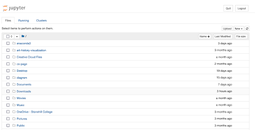
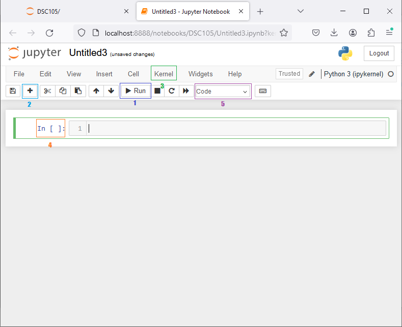
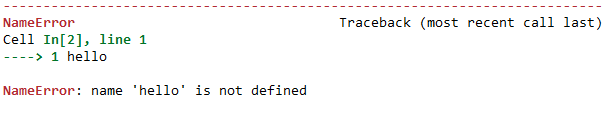

# Chapter 1: Jupyter and Python Basics

This page describes the basics of Python programming in Jupyter notebooks.

## Opening Jupyter

Our programming environment is called Jupyter Notebook, which allows us to write code in small executable cells. This environment is perfect for data science because we want to see the results of one line of code before we type the next one.

Jupyter is run using a client-server model. That means that you have to run two programs to use it.

* The server: this is a program that actually runs your code, but it doesn't have a user interface. You can start it by typing `jupyter notebook` in a terminal window, or running the "jupyter notebook" program through your start menu.
* The client: we access Jupyter through a web browser, which actually shows us a window to write our code. Your web browser is something like Google Chrome, Firefox, Safari or Edge. When you start the jupyter server, it will automatically open your web browser for you. If it doesn't, or if you need to access it, type in the address `localhost:8888` into the address bar at the top of your web browser.

While Jupyter is viewed through a web browser, it is not a website! It is actually running locally on your computer, so you can use it when you're not otherwise connected to the internet. Opening Jupyter will land you on this page, which gives you a view of your filesystem:



This is my home directory. On a Mac computer it is located at `/Users/yourusername/` where yourusername is your user name on the computer. On a windows computer, it would be at `C:/users/yourusername/`. I recommend creating a folder for content related to data science. Click New > Folder to create a new folder, then scroll down and check the box next to "Untitled Folder", then click "Rename" at the top and type "DSC105" (or whatever name you want) into the text box.

To create a new notebook, navigate to the location on your computer you would like it to go and click New > Notebook in the top right corner. You should see something like this (minus the colored boxes).



There are a few things to learn about this interface.

1. You write code in the box in the middle of the screen. This is a *code cell*. You run a code cell by clicking the "Run" button (box 1) or pressing the shift and enter keys at the same time. Try this out yourself by typing `1+1` in the code cell and pressing the run button.

2. When you run the cell, it will create a new code cell below it. You can also create a new cell by pressing the + button (box 2). Try typing hello. This will cause an error:

   

   You will become very familiar with Python error messages like this one. Errors are a natural part of programming, and in general they do not mean you are wrong or bad, they usually mean you typed something slightly wrong. Error messages like this one give us a lot of useful information:

   * `NameError`: this is the type of error, it's related to the word that we typed.
   * `Cell In[2], line 1`: this is where the error occurred.
   * `----> 1 hello`: this is what that line contained. When there are multiple lines, this will help us narrow down where the error is.
   * `NameError: name 'hello' is not defined`: this is the actual error message. It tells us that Python doesn't know what the word `hello` means yet. Let's leave this error message for now and continue.

3. Sometimes you will want to run all of the cells in your notebook from scratch. We can do that from the "Kernel" menu (box 3). The kernel is the program behind the scenes that actually executes your code. Kernel > Restart and Run All will kill whatever is currently happening and run all of your code again from scratch.

4. Jupyter shows which code is running and which code has already finished next to the code cell (box 4). When it says `In [*]`, that means your code is currently executing. When it says `In [1]` or some other number it means the code has finished. The space below the cell shows the output (labeled `Out [1]` or some other number). The number indicates the order in which the cells were run.

5. There are multiple different kinds of cells in Jupyter. We will use two: code cells and Markdown cells. Markdown cells allow us to add text in between our code cells, explaining our code. Try changing the third cell in your notebook to a markdown cell and typing hello. Running this cell will result in normal webpage text. In Chapter {{chapter_strings}}, we will explore what Markdown is and how we can use it to add formatting to these cells.


## Arithmetic

Data science requires doing math on numbers. We can use Python to do this math just like a calculator.

| Operator | Operation | Example | Result |
| -------- | --------- | ------- | ------ |
| +        | Addition        | `3 + 2` | `5`    |
| -        | Subtraction     | `3 - 2` | `1`    |
| *        | Multiplication  | `3 * 2` | `6`    |
| /        | Division        | `3 / 2` | `1.5`  |
| **       | Exponentiation  | `3 ** 2` | `9`   |
| //       | Integer Divison | `3 // 2` | `1`   |
| %        | Modulo (remainder) | `3 % 2` | `1` |

Try typing one of these examples into a code cell in your notebook.

You know the first few of these operations, but are likely unfamiliar with integer division and modulo. When you do division on a calculator, it typically "fully divides" the numbers, yielding a decimal number. On computers, however, sometimes we have reasons to want to avoid decimal results. Imagine we are dividing 11 donuts among 5 students. Each student gets two donuts, and then we have one left over at the end. The two is the result of integer division (each student gets 2 donuts) and the one left is the remainder, the result of the modulo (mod) operator.

The mod operator has another neat property: it allows us to figure out whether one number is *divisible* by an another number. For example, if we want to know if a number `n` is even or odd, we can use mod:  `n % 2` (read as "n mod two") will be 0 if the number is even (2 divides it without remainder) or 1 if the number is odd.

### Numbers

These operations introduce us to two types of numbers:
* Integers, whole numbers, like -2, 0, 4, 12, etc. (referred to as `int`)
* Floating point numbers, decimals, like 1.0, -2.3, 1234.5678 or 3.14159265 (referred to as `float`)

Numbers with decimals are called "floats" rather than "reals" or "rationals" for historical reasons. In the past, computers could only represent fixed-precision numbers, so 1/2 would be 0.500 instead of 0.5. Floating point numbers allow the decimal point to "float" at the minimum precision they need to represent the exact number, so they can both represent very small numbers and very large numbers.

Sometimes, when Python encounters very large numbers, they are represented using scientific notation. You may have seen something like

$$
6.2 * 10^{23}
$$
in a previous math or science class. In Python, these numbers are written with an e:
$$
\texttt{6.2e23}
$$
Which represents a 62... followed by 22 zeroes.

### Strings

Not all data is numerical, though! Very often, our data will be saved as sequences of characters, called "strings." In Python, strings are written with either single or double quotes (try to stay consistent). 

`'This is a string.'` 

`"This is also a string."`

`This isn't a string.`

Each letter or other symbol in the string is called a character. In these strings, 'T', 'i' and '.' are all characters. You can use the apostrophe character (') inside strings which are enclosed by double quotes and you can use the quote character (") inside strings which are enclosed by single quotes, but not vice versa. For example, the string `"I said "hello""` is invalid. Python will assume it's two strings: "I said " and "" (an empty string) with some invalid characters in between them. Changing the outer quotes `'I said "hello"'` fixes this problem. 

We can do arithmetic on strings just like numbers. Try typing in `"hello" + "world"` in a code cell. When you run it, the output is `"helloworld"`. Notice Python put the strings right next to each other. This is called string *concatenation*.

We can add a space in between the two by adding a space character to one of the strings: `"hello " + "world"`. This is a subtle difference, but it is important. Notice the little bit of space after hello. We call characters like spaces that show up as blank on the page "whitespace characters.

We can also use multiplication on strings.`"a" * 10` produces `"aaaaaaaaaa"`. Beyond addition and multiplication, none of the other arithmetic operations work on strings.

## Variables

If all Python could do was calculator functions, it wouldn't be very useful. The real power of a programming language like Python is its ability to store and manipulate data using *variables*. Variables in Python are words which hold values. For example:

`x = 1` 	The equals sign sets the value of the variable x to 1.

`x + 1` 	results in 2 because x is set to 1.

In general, we can think about variables as behaving like boxes. Each variable name is a box. When we use the `=` symbol, we put whatever is on the right of the equals into a box and label it with whatever is on the left of the equals. When we use the variable later on, Python searches for the box with that label and uses whatever is sitting in the box. If we put something else in the box, it replaces whatever was there before.

```python
a = 1
a = 5
a + 2
```

These three lines of code are perfectly legal, and result in 7. In the first line, we create a variable `a` and set it equal to 1. In the second line, we replace the 1 with a 5. In the third line, we check whatever is in `a` and add 2 to it. Since the value of `a` was most recently set to 5, we find a 5 there and add 2 to it, resulting in 7.

Python variables do not have to be one letter. In fact, we try to avoid single-letter variable names! Variables can contain any sequence of upper case letters, lower case letters, underscores (_) and numbers. They have to start with a letter and cannot use *reserved words* which mean something in the language such as `for`, `if`, `print`, `sum` or `input`.

Good variable names are descriptive. For example, if you are analyzing the finances of a business, you might have variables like `expenses` and `revenue` so that you can write lines of code like

`profit = revenue - expenses` 

We call lines of code that are easy to interpret "self-documenting" since they do not require additional documentation to understand.

## Functions

Many of the things we want Python to do are not simple arithmetic. For example, we may want to read files on our computer or convert integers into strings. Many of these operations can be accomplished by using Python *function*s. We call functions using parentheses like this:

 `function_name(argument1, argument2, ..., keyword_argument1=keyword_argument1_value, ...)`

We say that functions are *called* on their *arguments* which are values in between the parentheses. If you're familiar with writing
$$
y = f(x)
$$
in math class, f is the function name and x is the argument. In programming, we can sometimes pass multiple arguments into functions separated by commas.

### The `len` Function

Our first example of a function for data science is `len(sequence)`. This function takes a sequence (like a string) as an argument and *returns* the length of that string. For example:

```
len("hello")
```

produces the output:

```
5
```

because "hello" has five characters.

We can use variables for the input and output of functions:

```
my_name = "Sam Goree"
my_name_length = len(my_name)
my_name_length
```

Produces the output:

```
9
```

Step by step: we assign the string "Sam Goree" to the variable `my_name`, then we take its length and assign that value to the variable `my_name_length`, then we show its value by putting it on a line alone at the end of a cell.

### The `print` Function

The first function all programmers learn is called `print`. It allows us to show a value before our code finishes executing. Historically, before computers had screens, this meant literally printing a line on paper. We don't read our program output from paper anymore, but the name has stuck. We use the print function like follows:

```
x = 5
print(x)
x = x + 2
print("x is now", x)
```

This produces the output

```
5
x is now 7
```

When we pass multiple arguments to the print function, they get printed separated by a space. We can change that behavior by passing an additional *keyword* argument: `sep`. For example:

```
print("first", "second", sep="---")
```

This produces the output

```
first---second
```

This call to the `print` function has three arguments. The first two are called *positional* arguments while the third is a keyword argument which specifies the `sep` or separator as the string "---" instead of the string " ".

That's it for the basics of Python! Almost all of the programming that we do in data science consists of calling functions and assigning to variables.

# Practice Problems

1. 
